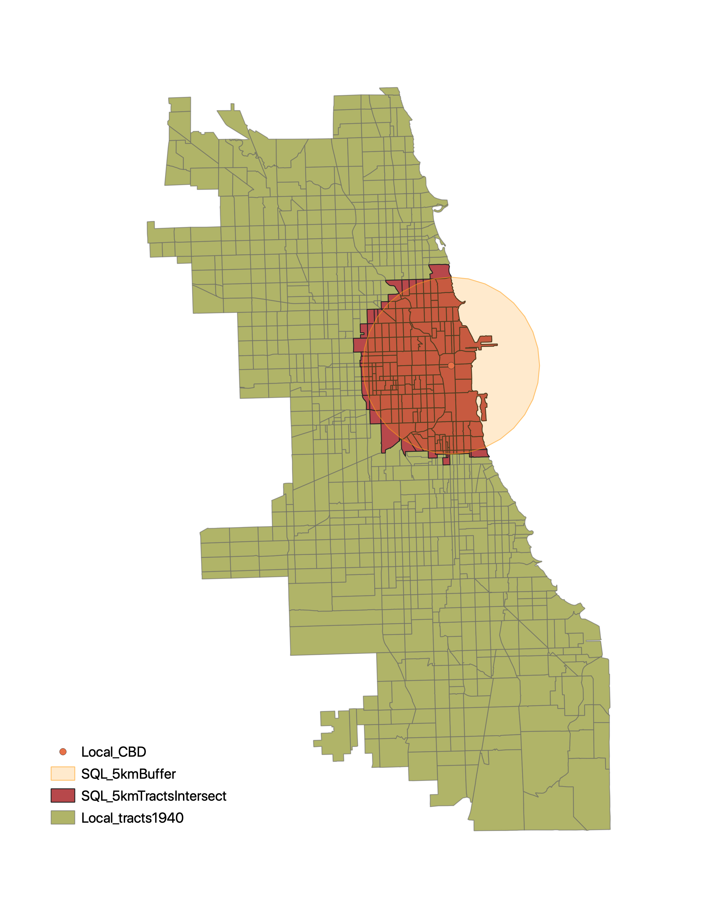
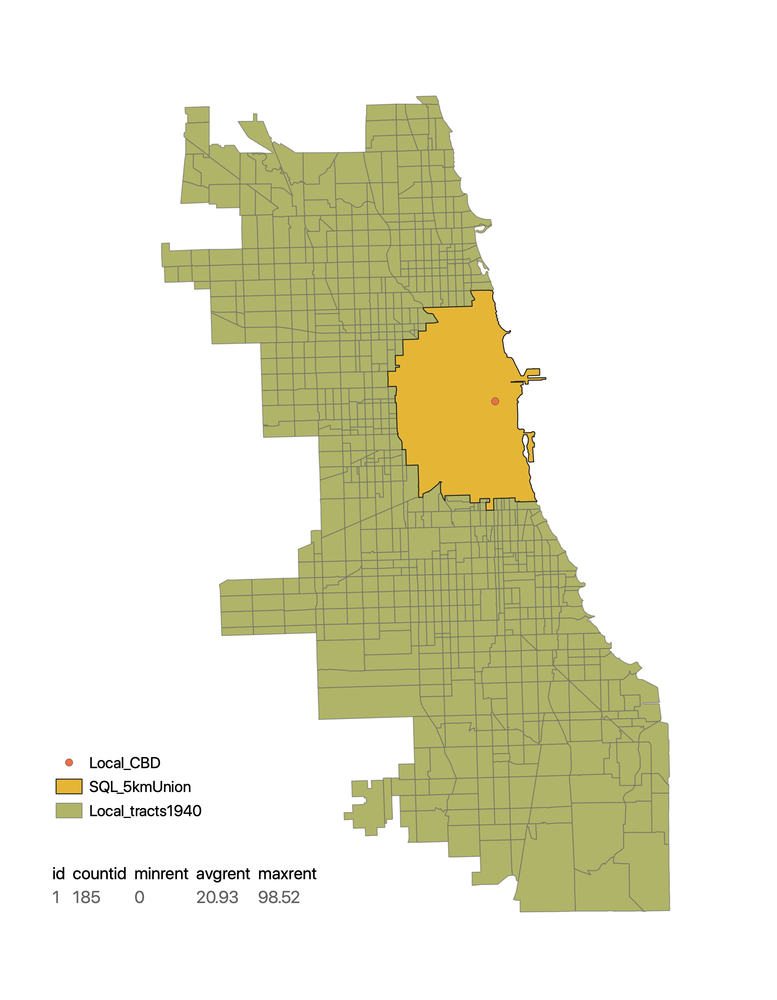

# Introduction to SQL with PostgreSQL

### Purpose

The goal of this exercise is to familiarize ourselves with Structed Query Language (SQL) in a postgis database. PostgreSQL is a open-source software that allows for spatial data to be stored, accessed, updated, and analyzed in a relational database context. There are a number of advantages of using PostGIS that range from efficiency by way of indexing to allowing multiple users to simultaneously update and work with data in a GIS. This [Medium article](https://medium.com/we-build-state-of-the-art-software-creating/why-should-i-use-postgresql-as-database-in-my-startup-company-96de2fd375a9#:~:text=%E2%80%9CPostgreSQL%20comes%20with%20many%20features,source%2C%20PostgreSQL%20is%20highly%20extensible.) effectively communicates the benefits of doing GIS in such an environment. This exercise will introduce some basic managment and analysis techniques in PostGIS.

### Software

The following softwares were used to complete this exercise:

* [QGIS 3.10](https://qgis.org/en/site/forusers/download.html)
* [PostgreSQL with PGAdmin 4 v4.26](https://www.pgadmin.org/download/pgadmin-4-macos/)

### Data

The data for this exercise includes of a geopackage of [1940 Chicago Census Tracts](data/chicagoTracts.gpkg) and a .csv file of [1940 Chicago Population by Tracts](data/popHousing1940.csv). These queries can be easily modified to analyze geographic data from a different area, as long as the shapefiles and the population data have a matching attribute field (pertaining to the geography) to join on.

### Using PGAdmin 4 on a Mac

If you do not have access to a PostGIS database already, here is a useful [set of directions](https://www.enterprisedb.com/postgres-tutorials/connecting-postgresql-using-psql-and-pgadmin) to install PG Admin 4 and running it with a local database (for Linux, Windows, or Mac).

### Connecting to PostGIS in QGIS and Loading Data

<details><summary> To connect to the database fromm QGIS, find the 'Database' menu and select 'DB Manager'. </summary>
    
  </details>

<details><summary> Import the downloaded geopackage and .csv into the database by selecting the 'Import Layer/File...' button. </summary>
    
  </details>

<details><summary> Select the correct file and import using the following parameters and refresh to see that it correctly loaded </summary>
    
  </details>
  
### Explore Data and Prepare for Spatial Analysis 

The following chunk of code will show you how to investigate your data before performing a join, perform and investigate the outcome of spatial join, filter and order data within a table, and create a virtual table from other tables.
  
```SQL
/* Check uniqueness of field*/

SELECT COUNT(DISTINCT gisjoin), COUNT(gisjoin) FROM tables1940

/* Left out Join tables1940 to tracts1940*/

SELECT*
FROM tracts1940 AS a LEFT OUTER JOIN tables1940 as b
ON a.gisjoin =b.gisjoin

SELECT*
FROM tracts1940 AS a LEFT OUTER JOIN tables1940 AS b
ON a.gisjoin = b.gisjoin

/* Check how many are tracts1940 unmatched to table 1940*/

SELECT*
FROM tracts1940 AS a LEFT OUTER JOIN tables1940 AS b
ON a.gisjoin = b.gisjoin
WHERE a.gisjoin IS NULL

/* Check how many tables1940 are unmatched to tracts1940*/

SELECT*
FROM tracts1940 AS a RIGHT OUTER JOIN tables19440 AS b
ON a.gisjoin = b.gisjoin
WHERE b.gisjoin IS NULL

/* Customize the Fields we want to join -- a.* means to get all of the columns from table a, which is tracts1940 */

SELECT a.*, b.poptotal, b.white, b.medgrossrent
FROM tracts1940 AS a LEFT OUTER JOIN AS b
ON a.gisjoin = b.gisjoin

/* Order by Median Gross Rent descending */

SELECT a.*, b.poptotal, b.white, b.medgrossrent
FROM tracts1940 AS a LEFT OUTER JOIN tables1940 AS b
ON a.gisjoin = b.gisjoin
ORDER BY medgrossrent DESC

/* Filter where Median Gross Rent > 0 and order in a descending manner */

SELECT a.*, b.poptotal, b.white, b.medgrossrent
FROM tracts1940 AS a LEFT OUTER JOIN tables1940 AS b
ON a.gisjoin = b.gisjoin
WHERE medgrossrent > 0
ORDER BY medgrossrent DESC

 /* CREATE VIEW is a slection query that appears in most respects like a table: like a virtual layer in a GIS -- pulling from other data tables that store actual data  */

CREATE VIEW tracts1940pop AS
SELECT a.*, b.poptotal, b.white, b.medgrossrent
FROM tracts1940 AS a LEFT OUTER JOIN tables1940 AS b
ON a.gisjoin = b.gisjoin
ORDER BY medgrossrent DESC
```
  
### Perform Distance and Direction Calculations

The following chunk of code will show you how to calculate distance and direction from a central point (in QGIS, the following operations would be done by creating centroid of the tracts and then using field calculator to add a distance and direction field to the tract table).

```SQL
/* Calculate distance from CBD */

SELECT *,
DEGREES(ST_AZIMUTH(
(SELECT ST_TRANSFORM(geom, 3395) FROM cbd),
ST_CENTROID(ST_TRANSFORM(geom, 3395)))) AS dir 
FROM join1940

/* Calcualte distance and direction from CBD */

SELECT *,
ST_DISTANCE(
ST_CENTROID(GEOGRAPHY(ST_TRANSFORM(geom, 4326))),
(SELECT GEOGRAPHY(ST_TRANSFORM(geom, 4326) )FROM cbd)) AS dist,
DEGREES(ST_AZIMUTH(
(SELECT ST_TRANSFORM(geom, 3395) FROM cbd),
ST_CENTROID(ST_TRANSFORM(geom, 3395)))) AS dir 
FROM join1940

/* Create view of tracts1940 with dist and direction from cbd calculated */

CREATE VIEW tracts1940_disdir2 AS
SELECT *,
ST_DISTANCE(
ST_CENTROID(GEOGRAPHY(ST_TRANSFORM(geom, 4326))),
(SELECT GEOGRAPHY(ST_TRANSFORM(geom, 4326) )FROM cbd)) AS dist,
DEGREES(ST_AZIMUTH(
(SELECT ST_TRANSFORM(geom, 3395) FROM cbd),
ST_CENTROID(ST_TRANSFORM(geom, 3395)))) AS dir 
FROM tracts1940
```
### Reproject a Table

```SQL
/* Select new version of cbd with proper projection */

SELECT id, ST_TRANSFORM(geom, 3528) AS geom
FROM cbd

/* Save properly projected cbd as a permanent table */

CREATE TABLE cbd5328 AS
SELECT id, st_transform(geom,5328) AS geom2
FROM cbd
```

### Visualize Locally in QGIS

To visualize data locally, left click the desired table and select 'Add to Canvas'. The data must be visualized like any other, updating the 'Symbology' in the layer's 'Properties'.

### Fix Table Information and Geometries

* A table's 'primary key' is a unique identifier (id field) that should be defined in any table. It is an essential component of a relational database that identifies a row's uniqueness (in this scenario, the primary key indicates a unique census tract). 
* A table's geometry will specify whether or not it is a polygon, polyline, or point. A table's geometry must be specified before performing spatial analysis. 
* Spatial indices are useful for saving time when performing spatial overlay functions (unions, intersects, differences) on larger datasets as they set a bounding box around points to prevent the function from running through the entire dataset.

```SQL
* FIXING GEOMETRY/TABLES */

/* Add Primary Key */

ALTER TABLE cbd5328 ADD PRIMARY KEY (id)

/* Updating geometry */

SELECT populate_geometry_columns('public.cbd5328'::regclass) /*1 means it works*/

/* To create a spatial index, simply go to the "info" tab and select "create it" if the page says "No spatial index defined"

/* See characteristics of Geometry */
	
SELECT *,
St_astext(geom2),
St_srid(geom2),
Geometrytype(geom2),
St_dimension(geom2),
St_numgeometries(geom2),
St_numpoints(geom2),
St_isvalid(geom2)
FROM cbd5328
```

### Buffers

The following chunk of code shows how to perform a 5kmm buffer from the CBD and a save it as it's own table. The following code also incorporates queries to update geometries.

```SQL
/* Buffer 5km from cbd5328 */

SELECT id, ST_BUFFER(geom2, 5000) AS geom
FROM cbd5328

/* Create View of Buffer */

CREATE TABLE cbd5km AS
SELECT id, ST_BUFFER(geom2, 5000) AS buffzone
FROM cbd5328

/* Update geometry */

SELECT populate_geometry_columns('public.cbd5km'::regclass) /*1 means it works*/

/* See characteristicsof Geometry */

SELECT *,
St_astext(geom),
St_srid(geom),
Geometrytype(geom),
St_dimension(geom),
St_numgeometries(geom),
St_numpoints(geom),
St_isvalid(geom)
FROM cbd5km

/* Select all tracts that are w/in 5km of cbd by adding intersection*/

SELECT *
FROM join1940
WHERE ST_INTERSECTS(geom, (SELECT geom FROM cbd5km))

/* Try query with buffer calculation */

SELECT *
FROM join1940
WHERE ST_INTERSECTS(geom,(SELECT ST_BUFFER(geom2, 5000) from cbd5328))


/* Create table from intersect query with buffer*/

CREATE TABLE cbd1940 AS
SELECT *
FROM join1940
WHERE ST_INTERSECTS(geom,(SELECT ST_BUFFER(geom2, 5000) from cbd5328))

/* Update geometry */

SELECT populate_geometry_columns('public.cbd5km'::regclass) /*1 means it works*/
```

This map visualizes both the buffer query and the intersect on a buffer query. This visualization can be done by adding the tables to the canvas.

<p align="center">

</p>

### Aggregate and Summary Functions

The following chunk of code shows how to perform aggregate geometries by using Unions or Intersects while also outputting statistical summaries from those functions. 

```SQL 
/* Find mean, min, max, and total (tracts) of rent from tracts*/

SELECT COUNT(id) AS countID, 
MIN(medgrossrent) as minRent, 
AVG(medgrossrent) as avgRent, 
MAX(medgrossrent) as maxRent
FROM cbd1940

/* Aggregate function for geometries*/

CREATE VIEW cbdunion AS
SELECT 1 as id, 
COUNT(id) AS countID, 
MIN(medgrossrent) as minRent, 
AVG(medgrossrent) as avgRent, 
MAX(medgrossrent) as maxRent, 
ST_UNION(geom) as geom
FROM cbd1940


/* Aggregate function and reproject*/

CREATE TABLE cbdunion2 AS
SELECT 1 as id, 
COUNT(id) AS countID, 
MIN(medgrossrent) as minRent, 
AVG(medgrossrent) as avgRent, 
MAX(medgrossrent) as maxRent, 
ST_UNION(ST_TRANSFORM(geom, 3528))::geometry(multipolygon, 3528) as geom
FROM cbd1940
```

The following map visualizes the cbdunion2 output.

<p align="center">

</p>
