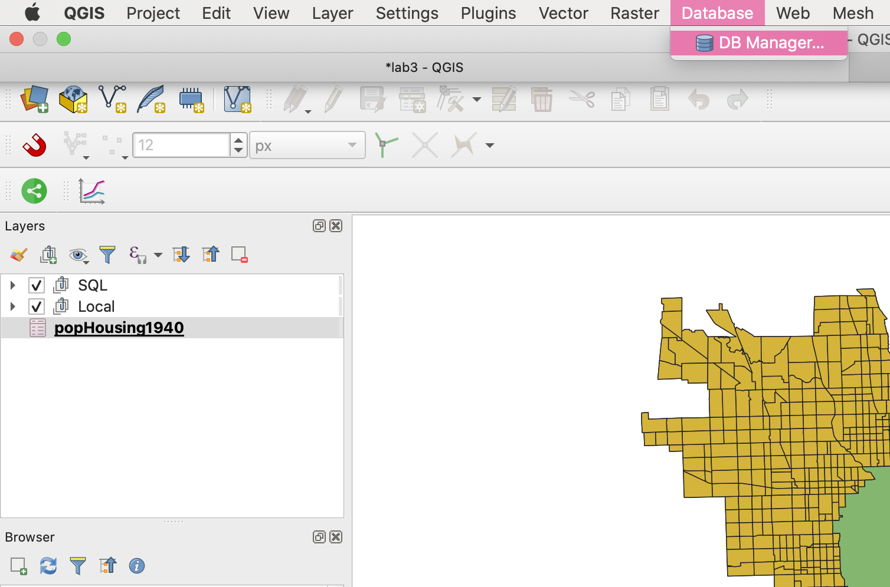
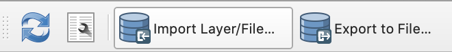
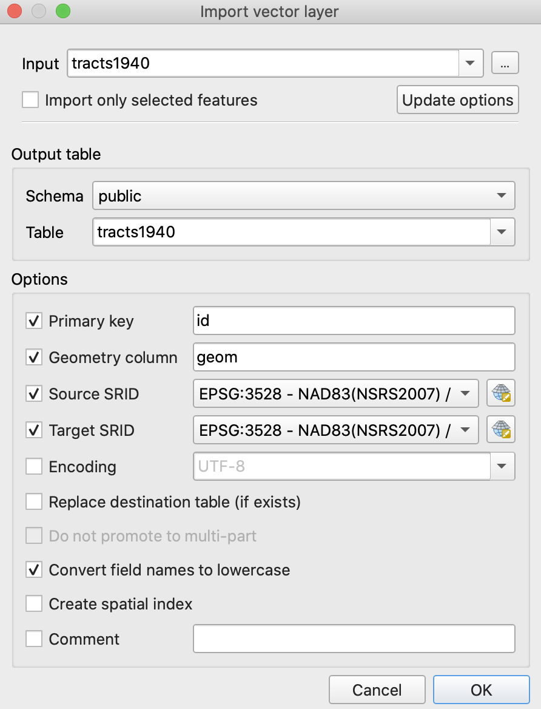

# Introduction to SQL with PostgreSQL

### Purpose

The goal of this exercise is to familiarize ourselves with Structed Query Language (SQL) in a postgis database. PostgreSQL is a open-source software that allows for spatial data to be stored, accessed, updated, and analyzed in a relational database context. There are a number of advantages of using PostGIS that range from efficiency by way of indexing to allowing multiple users to simultaneously update and work with data in a GIS. This [Medium article](https://medium.com/we-build-state-of-the-art-software-creating/why-should-i-use-postgresql-as-database-in-my-startup-company-96de2fd375a9#:~:text=%E2%80%9CPostgreSQL%20comes%20with%20many%20features,source%2C%20PostgreSQL%20is%20highly%20extensible.) effectively communicates the benefits of doing GIS in such an environment. This exercise will introduce some basic managment and analysis techniques in PostGIS.

### Software

The following softwares were used to complete this exercise:

* [QGIS 3.10](https://qgis.org/en/site/forusers/download.html)
* [PostgreSQL with PGAdmin 4 v4.26](https://www.pgadmin.org/download/pgadmin-4-macos/)

### Data

The data for this exercise includes of a geopackage of [1940 Chicago Census Tracts](data/chicagoTracts.gpkg) and a .csv file of [1940 Chicago Population by Tracts](data/popHousing1940.csv). These queries can be easily modified to analyze geographic data from a different area, as long as the shapefiles and the population data have a matching attribute field (pertaining to the geography) to join on.

### Using PGAdmin 4 on a Mac

If you do not have access to a PostGIS database already, here is a useful [set of directions](https://www.enterprisedb.com/postgres-tutorials/connecting-postgresql-using-psql-and-pgadmin) to install PG Admin 4 and running it with a local database (for Linux, Windows, or Mac).

### Connecting to a PostGIS from QGIS and Loading Data

 To connect to the database fromm QGIS, find the 'Database' menu and select 'DB Manager'. 

    
  

 Import the downloaded geopackage and .csv into the database by selecting the 'Import Layer/File...' button. 

    
  

 Select the correct file and import using the following parameters 

    
  

  
  

