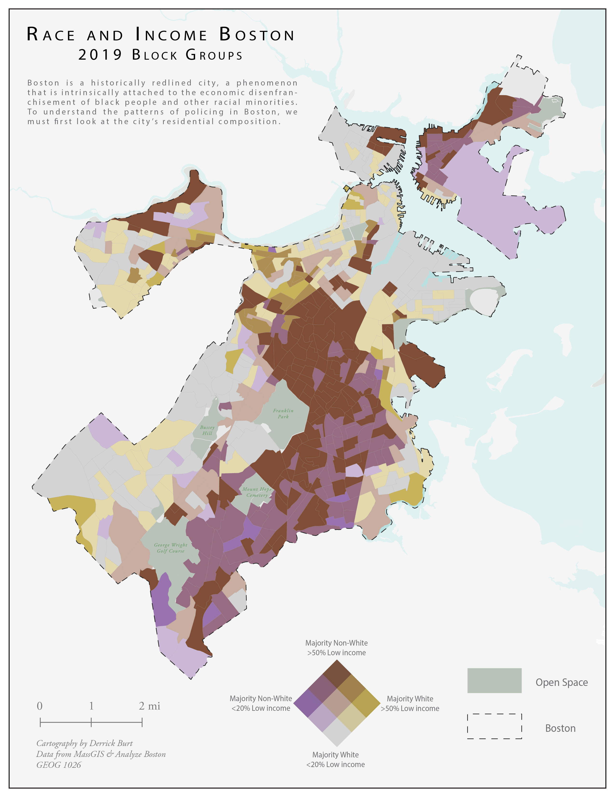
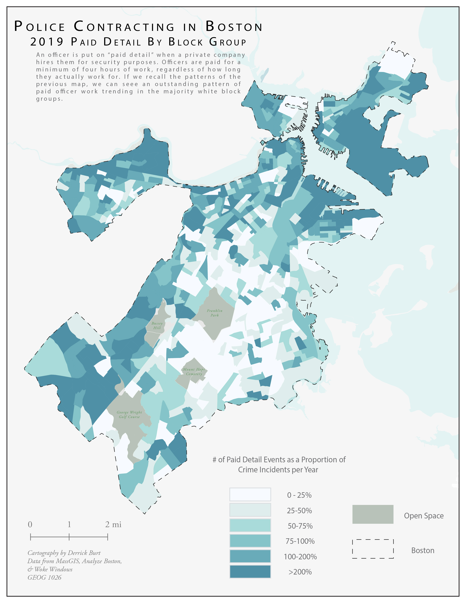
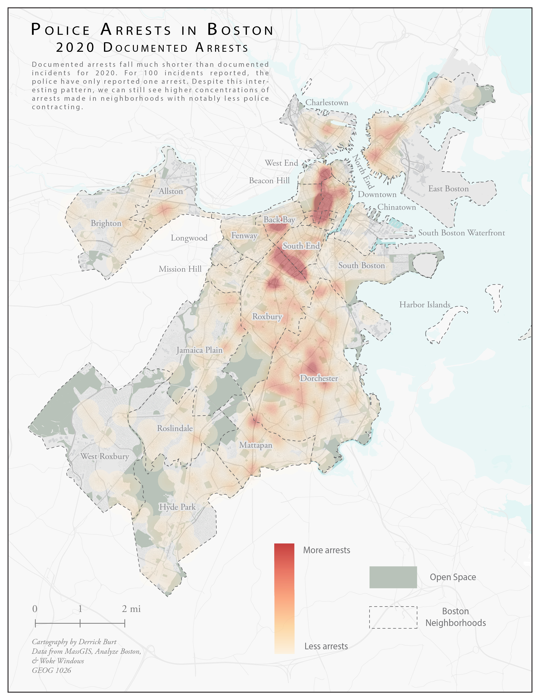

# Demographics and Policing Patterns in Boston, MA

### Purpose
This visualization exercise aims to show residential patterns by income and race in Boston and compare them to the spatial layout of police contracting by private companies as well as arrests.

### Software

* [QGIS 3.10](https://qgis.org/en/site/forusers/download.html)
* [Adobe Illustrator](https://www.adobe.com/products/illustrator/free-trial-download.html)

### Data

* [MassGIS](https://docs.digital.mass.gov/dataset/massgis-data-layers)
* [Woke Windows Project](https://www.wokewindows.org/exports)

### JPGS

* [2019 Race & Income](BivariateBoston.jpg)
* [2019 Police Contracting(Paid Detials)](PaidDetail.jpg)
* [2020 Arrests](HeatMapFinal.jpg)

### Maps

