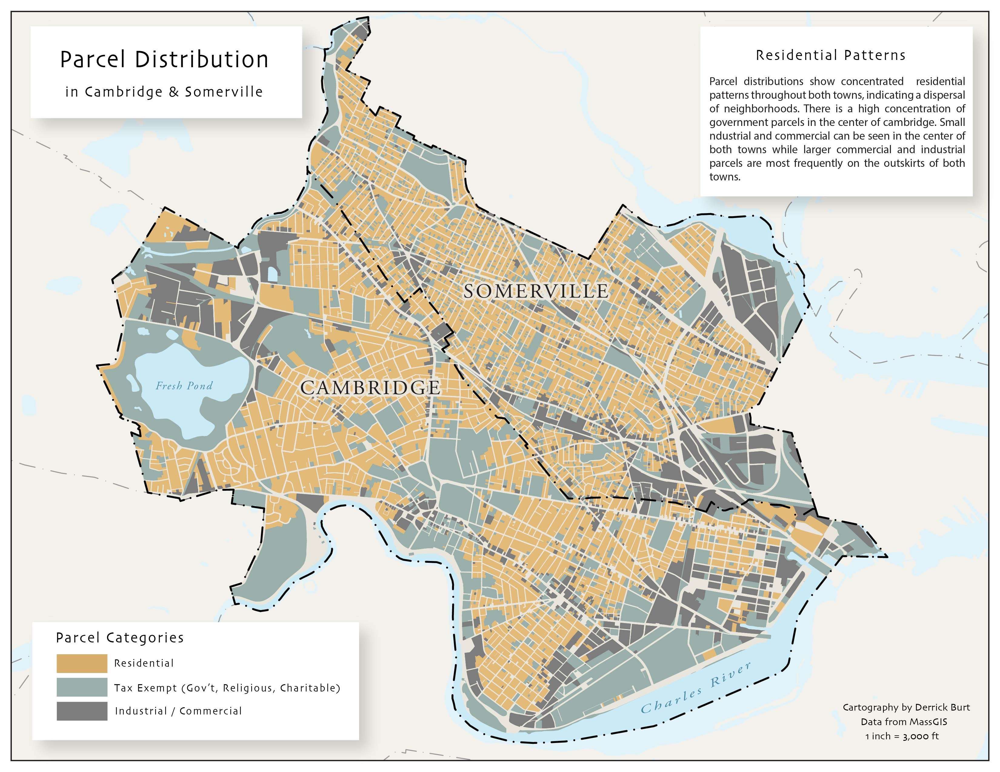

# Public Transit Access in Cambridge and Somerville, MA

### Purpose

These maps aim to identify the accessibility of bus stops by foot in Cambridge and Somerville in relation to the towns' land use patterns.

### Software

* [QGIS 3.10](https://qgis.org/en/site/forusers/download.html)
* [Adobe Illustrator](https://www.adobe.com/products/illustrator/free-trial-download.html)

### Data

* [MassGIS](https://docs.digital.mass.gov/dataset/massgis-data-layers)

### Maps

