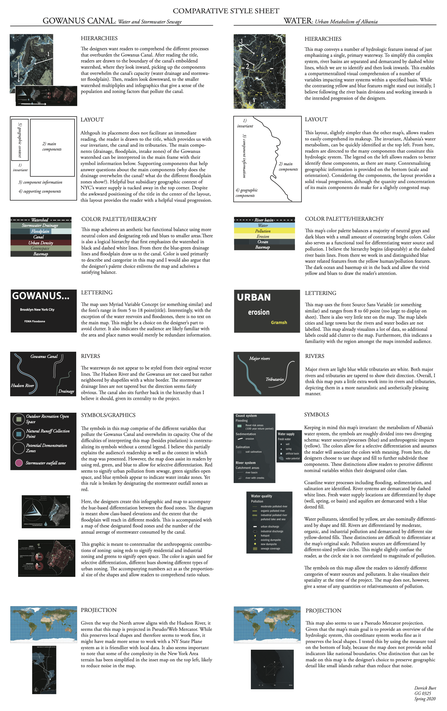

# Urban Planning: Design Critique

### Purpose

This exercise compares important design choices between two urban planning maps.

### The Maps

#### Gowanus Canal 

  
  

#### Albanian Rivers

  
  

### Design Critique

### Final Thoughts

These maps communicate urban hydrological issues with an urban planning and architectural approach. In addition to their thematic overlap, these maps also look quite similar to each other, using subdued greys and black for their basemaps and structuring similar hierarchies. Despite these thematic and visual overlaps, the two maps operate at different scales and accordingly visualize distinctive components to convey their respective invariants. 

The first map, “Gowanus Canal: Water + Stormwater Sewage,” addresses water management of the Gowanus Canal and was created by urban designers Paul Xiaopu Wang and Crisipin de Oliver for a waterworks competition in New York. The second map, “Water: Urban Metabolism Albania,” addresses the hydrological network of Albania and was designed by a team from an urban architectural design firm called FABRICations.  Both maps are clearly designed with an urban planner’s task of situating urban and industrial impacts on ecological health; in this case they specifically look at hydrological impacts. Although both maps fall into the category of urban architecture and planning, they are still designed in distinctive contexts with separate criteria.  

FABRIcation’s Albanian water map is a part of a larger project that also maps Albania’s energy, food, and tourism. Therefore, the designers of this map are considering Albania’s water system in the context of other facets of sustainable development (note that urban areas are labelled but rivers are not). With regards to this contextualization, this map provides a breadth of static and nominal variables such as river basins, sewage locations, industrial waste, and other location-dependent components over Euclidean space. In a large sense, this map provides a generalized spatialization of Albania’s natural and constructed water system. As a result, specific questions about quantities and temporal pollution processes cannot really be answered.

Wang and Crispin’s map is focused specifically on the Gowanus Canal and its capacity to handle the anthropogenic impacts on its watershed. As a result of this localized scale, the designers choose to include localized data (zoning and floodplain classes). This allows for a flexibility in data visualization, including both nominal variables (watershed location, sewers, etc.) and quantitative variables (population densities). Therefore, the map directs readers to understand which variables within the Gowanus watershed contribute to the overwhelming of its capacity and its pollution. This map allows readers to identify a more contextualized and quantifiable understanding of its components.  

Perhaps the key takeaway from this critique is the ability of these maps to implement fairly similar design principles and yet, as a result of their geographic distinctions of magnitude and scale, the maps diverge and produce different explanations for their problem. The Gowanus map visualizes a traceable cause; population density as a result of zoning. The Albania map, on the other hand, visualizes the spatial relationship of urban systems and water systems at large. Given their respective invariants, I think both maps succeed in providing a logical visualization of data.

I believe these maps show us that certain principles like color theory and intellectual hierarchy can be applied in a rigid and objective sense; the maps rely on these despite their geographic differences. However, they also tell us that distinct and subjective design choices must be made when visualizing data at different scales as the ability to construct a type of narrative or quantitative explanation varies at different scales.
