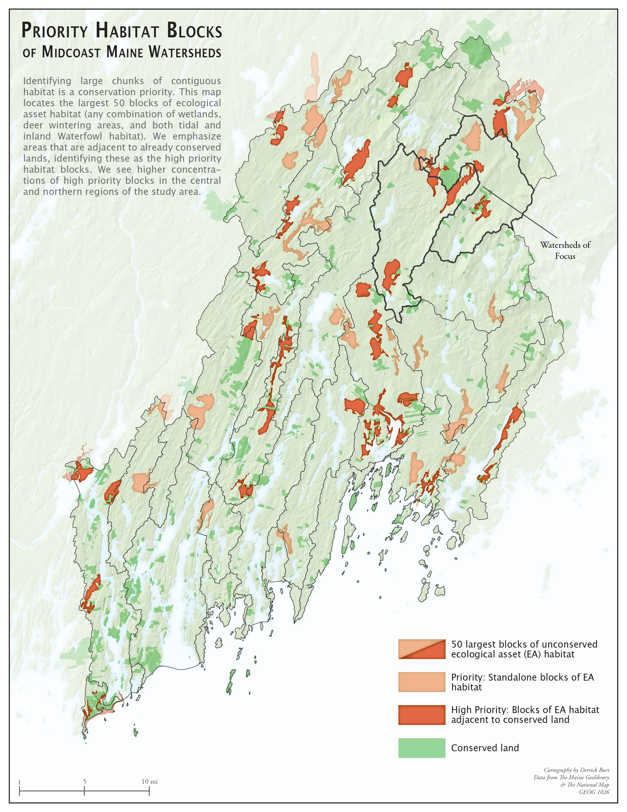

# Watershed Conservation in Midcoast Maine

### Purpose

This set of maps aims to define and locate high priority habitat blocks that are not conserved in Coastal Maine.

### Software

* [QGIS 3.10](https://qgis.org/en/site/forusers/download.html)
* [Adobe Illustrator](https://www.adobe.com/products/illustrator/free-trial-download.html)

### Data

* [Maine GeoLibrary](https://www.google.com/search?q=maine+geolibrary&rlz=1C5CHFA_enUS732US732&oq=maine+geolibrary&aqs=chrome..69i57j0l2j0i22i30.3845j1j1&sourceid=chrome&ie=UTF-8)
* [The National Map](https://www.usgs.gov/core-science-systems/national-geospatial-program/national-map)

## JPGS

* [Habitat Blocks](Regional_HabitatBlocks.jpg)
* [Proprtions of Conserved Ecological Assets](Regional_ConservedSymbols.jpg)
* [Watershed Eco Co-Occurence](Watershed_EcoAreas2.jpg)

### Maps

