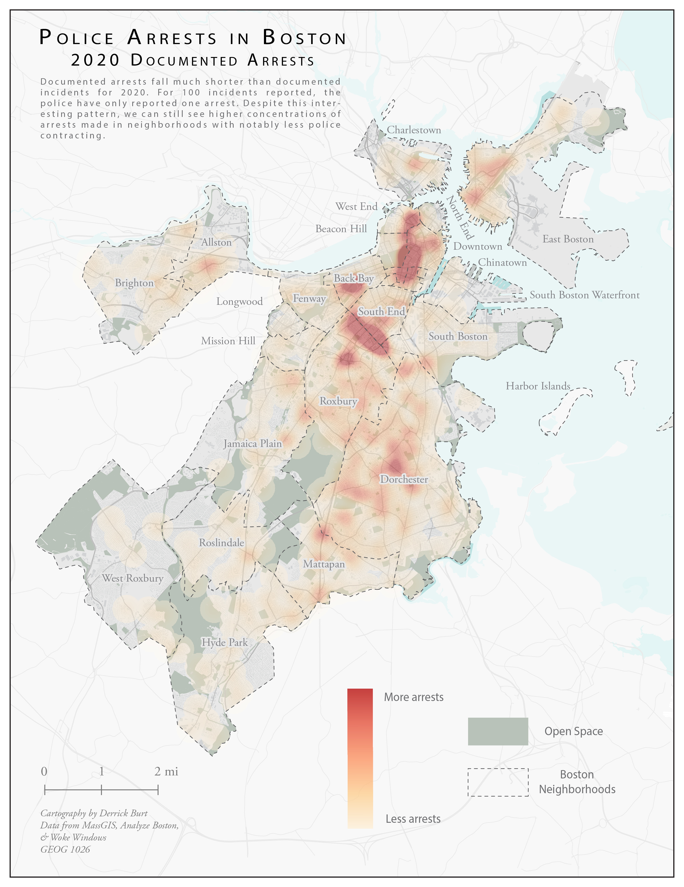

### [Solar Site Suitability/Development Potential in Chittenden County, VT](vtSolar/vtSolar.md)
*Analyzing solar suitability in Chittenden County and reccomending most-suitable parcels.*

  
  

### [Watershed Conservation in Midcoast Maine](maine/maine.md)
*Defining and identifying high priority habitat blocks that are not conserved in Coastal Maine.*

   

### [Demographics and Policing Patterns in Boston, MA](bostonPolice/bostonPolice.md)
*Analyzing residential demographics, arrests, and private police contracting in Boston, MA.*

   

### [Public Transit Access in Cambridge and Somerville, MA](camberville/camberville.md)
*Assesing the accessibility of bus stops by foot in Cambridge and Somerville, MA.*

   

### [Visualizing Urban Growth in Lagos, Nigeria](lagos/lagos.md)
*Vizualizing Lagos' growth from 1984 to 2013 and its drivers.*

   

### [Urban Planning: Design Critique](crit/crit.md)
*This exercise compares important design choices between two urban planning maps.* 

   

