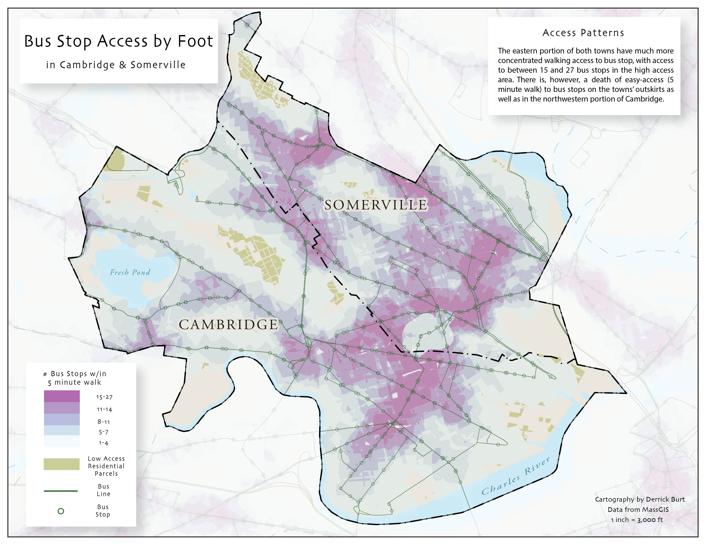

# [Maps](cart/pages.md)

<table align="center" width="100%" cellpadding="0" cellspacing="0">
    <tr>
        <td> <a href="https://derrickburt.github.io/cart/vtSolar/vtSolar.html"> 
        <td> <a href="https://derrickburt.github.io/cart/maine/maine.html"> 
        
        <td>
    </tr>
</table>

# [Code](opengis/pages.md)

