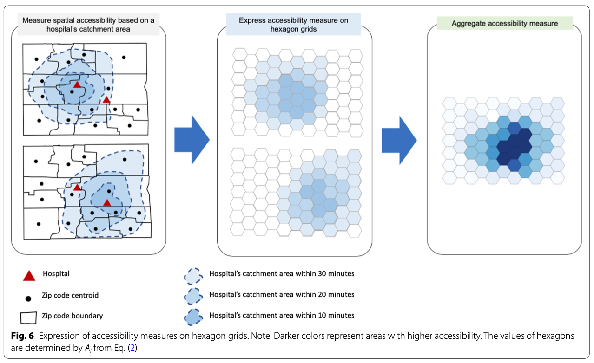
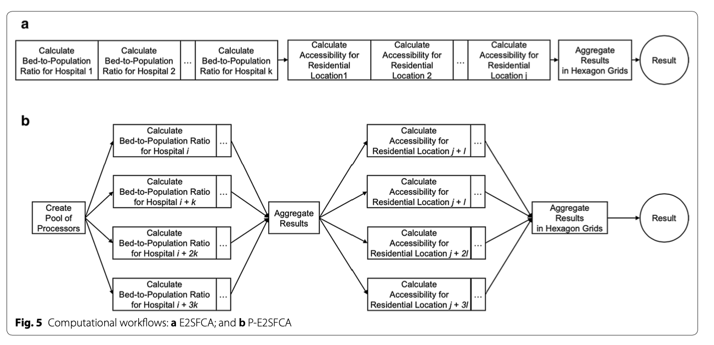

# Reproducing CyberGISX Analysis: Rapidly Measuring Spatial Accesibility of COVID-19 Healthcare in Connecticut

### About 

In their paper, "Rapidly Measuring Spatial Accessibility of COVID-19 Healthcare Resources: A Case Study of Illinois, USA", Kang et al. implement a methodology that measures and visualizes the access that two different populations, COVID-19 patients and the population risk (defined as those over 50), have to two important resources, ICU beds and Ventilators. 

To rapidly measure accessibiity to Covid-19 healthcare, Kang et al. developed a methodology for [parallel implementation](https://www.omnisci.com/technical-glossary/parallel-computing#:~:text=Parallel%20computing%20refers%20to%20the,part%20of%20an%20overall%20algorithm.) of an Enhanced Two-Step Floating Catchment Area (E2FSCA) methodology. This method calculates the ratio between a service (in this scenario, hospital ICU beds or ventilators) and a population with a surrounding area, accounting for distance decay. Because this is a computationally intensive analysis hat uses large street networks, the authors developed a parallel-E2FSCA (P-E2FSCA), which enables the use of up to 4 processors while implementing the analysis.

The following resources document their methodology, data, and results:
* [Paper](Paper/Kang_spatialAccessibilityCovid.pdf): an overview of the problem, description of and conceptual methodology, results, and conclusion
* [Jupyter Notebook](https://cybergisxhub.cigi.illinois.edu/notebook/rapidly-measuring-spatial-accessibility-of-covid-19-healthcare-resources-a-case-study-of-illinois-usa/): a reproducible implementation of the paper's methodology (requires a [CyberGISX](https://cybergisxhub.cigi.illinois.edu/registration/) account)
* [Github Repository](https://github.com/cybergis/COVID-19AccessibilityNotebook): has the notebook and all the necessary data
* [Where COVID-19 Spatial Access Dashboard](https://wherecovid19.cigi.illinois.edu/spatialAccess.html): A live dashboard that displays the daily accessibility calculated from this methodology

### Purpose

The purpose of this exercise is to replicate Kang et al's methodology, using a Jupyter Notebook on their CyberGISX platform, to calulate spatial accessibility of COVID-19 healthcare resources in Connecticut. I will briefly summarize their methodology, walk through the process of acquiring and processing the necessary data for Connecticut, show and explain the code modifications that were made to Kang et al's Notebook for this replication, explain the results, and comment on the methodology and the process of replication.  

*Important*: 
* Most of the code is an exact replication of Kang et al.'s methodology (unless explicitly noted, it should be assumed that any code was written by Kange et al.)
* Note on reproducibility: the notebook was run in the CyberGISX environment, so even with the data and notebook provided, my replication is only exactly reproducible within the CyberGISX platform. Otherwise, you will need to install all of the python packages on your local jupyter platform, and then the notebook should work.

### Kang et al. Methodology

To the measure spatial accessibility of COVID-19 healthcare resources, Kang et al. use a P-E2SFCA. Essentially, their two-step methodology first finds the size of the population (either COVID-19 patients or population over fifty) of  within stagerred catchment areas of hospitals. They do this locating the nearest node on Open Street Map network (specifically using [OSMNX](https://osmnx.readthedocs.io/en/stable/_), a python package to import OSM networks) to each hospital, and calcuating catchment areas off 10, 20, and 30 minute drive times. The population of a catchment area is found by locating the centroids of the population's given geography (for covid, zip code level, and for over fifty, census tracts) within the catchment area. After the catchment areas are calculated, a [service-to-population ratio](Photos/ratio.png) is calculated to find the available resources (ICU beds or Ventilators) to the desired population. To allow for comparison, an [accessibility measurment](photos/accessibility.png). These accessibility measures are mapped onto hexagonal grids, and then aggregated onto one hexagonal grid, measuring accessibility on a relative scale of 0 to 1 (1 being the relatively most accessible, 0 being relatively least). More accessible areas will be those with the most overlapping catchment areas with more available resources (clusters of hospitals with more resources). This workflow is implemented in a parallel fashion, splitting up the computational steps between between 1, 2, 3, or 4 processors (based on user's choice).

These accessibility measurements produce 4 outputs: At Risk population's access to ventilators, Covid patients access to ventilators, At Risk population's access to ICU beds, Covid patients access to ICU beds. This analysis is done for both Chicago as well as the entire state of Illinois.

This figure, from the paper, provides a conceptual workflow of the spatial analysis:



This figure, from the paper, provides a conceptual workflow of the parallel computation:



Additionally, the authors' compare the [Social Vulnerability Index](https://www.atsdr.cdc.gov/placeandhealth/svi/index.html) in high and low accessibility areas. This portion of the analysis is not included in the Jupyter notebook.

### Replicating the Notebook for Connecticut

I have attempted to replicate Kang et al.'s methodology for the State of Connecticut. The following steps outline the process of gathering the data, preparing it for analysis, tweaking the notebook, and the results. Most of the analysis follows Kang et al's methodology, but here are some important deviations my replication has taken from their analysis:

* I only examine accessibility at the state level for Connecticut 
* There was no available ventilator data for CT, so I examine accessibility to ICU beds and total beds
* I include hospitals in RI, MA, and NY that are within 15km buffer of the CT border, to account for CT residents that may cross state lines for COVID care


#### Software

The following software was used in the analysis:

* [Microsoft Excel](https://office.live.com/start/excel.aspx)
* [QGIS 3.10](https://qgis.org/en/site/forusers/download.html)
* [Jupyter Notebook](https://jupyter.org/) on [CyberGISX Platform](https://cybergisxhub.cigi.illinois.edu/registration/)

#### Data and Notebook

The following data was used for the analysis, all of the shapefiles can be downlaoaded from this [geopackage](Data/CT_Final.gpkg):

* Hospital Shapefile and Bed Data from [HIFLD Open Geoplatform](https://hifld-geoplatform.opendata.arcgis.com/datasets/hospitals?geometry=-94.504%2C40.632%2C-80.980%2C43.486) 
* ICU Beds from the [Department of Health](https://healthdata.gov/dataset/covid-19-reported-patient-impact-and-hospital-capacity-facility)
* CT Census Tract Boundaries from [Census Bureau](https://www.census.gov/geographies/mapping-files/time-series/geo/carto-boundary-file.html )
* CT Census Tract Population by Age from [Census Burearu](https://data.census.gov/cedsci/)
* CT Active Covid Cases by Town (11/15/20-11/28/20) from [CT Open Data Portal](https://portal.ct.gov/Coronavirus/COVID-19-Data-Tracker)
* Town Shapefile from [CT Open Geodata Portal](https://ct-deep-gis-open-data-website-ctdeep.hub.arcgis.com/search?groupIds=71c5c4a9c6ea4ea8ab54d1bf1faaeed8 )

The final verison of my notebook can be downloaded [here](CTSpatialAccessibility (1).ipynb) - If you are not running on CyberGISX platform, you must install all libraries in the first code cell.

#### Preparing the Data

##### Hospitals

The Hospital shapefile data was brought into QGIS prepared with the following steps:

1) Draw a 15km buffer around state ('ctState' in geopackage): ```Processing Toolbox > Buffer > parameters: input layer: 'ctShapefile', distance: '15km', output: 'Buffered'```
2) Extract hospitals the intersect are within buffer: ```Processing Toolbox > Extract by Location > parameters: Extract features from: 'hospitals',  where the features : 'intersect', 'are within', by comparing to features from: `Buffered`, output: 'hospitalsBuffered'```
3) Eliminates duplicates (each hospital had a duplicate in attribute table: ```Processing Toolbox > Delete duplicates by feature attribute > parameters:  Input layer: `hospitalsBuffffered`, Fields to match duplicate by: `NAME`, output: hospitalsNoDup```
4) Select only hospitals that are "GENERAL ACUTE CARE": ```Processing Toolbox > Extract by Expression > paramters: Input layer: 'hospitalsNoDup', Expression: "TYPE" = 'GENERAL ACUTE CARE', output:'hospitalsCToICU'```

The ICU Bed data was brought into QGIS and cleaned with the following steps:

1) Keep the first 13 fields (important hospital information) as well as 'total_icu_beds_7_day_avg' from hospitalsICU by navigating ```Properties > Fields > Toggle editing mode > Delete Fields``` and deleting the undesired fields
2) Join hospital ICU data to hospital shapefile by address (somehow this worked, all 65 hospitals in both datasets had the samme exact address: ```Processing Toolbox > Join Attributes by Field Value > parameters: Input layer: 'hospitalsCT', Table field: `ADDRESS`, Input layer 2: 'hospitalsICU1`, Table field: `address`, Layer 2 fields to copy: 'ICU', Join type: 'one-to_one', output: 'hospitalsCT'```

The Population data was cleaned in Excel (summing the population age groups (50-54....85+) into 'OverFifty' and then brought into QGIS as 'popTracts' and processed with te following step:

1) Join the population over Fifty to the tracts: ```Processing Toolbox > Join Attributes by Field Value > parameters: Input layer: 'tracts', Table field: `AFF_GEOID`, Input layer 2: 'popTracts`, Table field: `GEOID`, Layer 2 fields to copy: 'OverFifty', Join type: 'one-to_one', output: 'csTracts'

The Covid data was cleaned in QGIS with the follow step:

1) Join the covid cases to the towns: ```Processing Toolbox > Join Attributes by Field Value > parameters: Input layer: 'town', Table field: `Name`, Input layer 2: 'ctCovid`, Table field: `Name`, Layer 2 fields to copy: 'cases', Join type: 'one-to_one', output: 'covidTowns'

The hexagonal grid was processed in QGIS with the following step:

1) Create a hexagonal from 'ctState': ```Processing Toolbox > Create Grid > parameters: Grid type: 'hexagon', Grid extent: Use layer extent ('ctShape'), Horizontal spacing: 1.5km, Vertical spacing: 1.5km, Grid CRS: EPSG:32618, output: ctGrid```

With all the necessarry shapefiles prepared, the data were uploaded ot the CyberGISX notebook.

#### Altering the Notebook

The following chunks of code were altered from Kang et al. to replicate the P-E2SFCA methodology for the stape of Connecticut. Code is commented #DERRICK: where it was altered by myself and commented #JOE where altered by Professor Holler.

<details> <summary markdown="span"> Load population data:</summary>
	
```py
#DERRICK: change to CT overy fifty by tracts
pop_data = gpd.read_file('./CTData/PopData/csTracts.shp')
pop_data.head()
```

</details>
<br/>

<details><summary markdown="span"> Load covid data:</summary>

```py
#DERRICK: change to CT covid by town
pop_data = gpd.read_file('./CTData/PopData/covidTown.shp')
pop_data.head()
```

</details>	
<br/>

<details><summary markdown="span"> Load hospital data:</summary>

```py
#DERRICK: change to CT hospitals
hospitals = gpd.read_file('./CTData/HospitalData/hospitals.shp')
hospitals.head()
```

</details>	
<br/>


<details><summary markdown="span"> Map hospital data:</summary>

```py
# DERRICK: switch lat long to CT, bring out starting zoom a bit
m = folium.Map(location=[41.5, -72.65], tiles='cartodbpositron', zoom_start=8.47)
for i in range(0, len(hospitals)):
    folium.CircleMarker(
    # DERRICK: add CT data, edit lat long and pop ups
      location=[hospitals.iloc[i]['LATITUDE'], hospitals.iloc[i]['LONGITUDE']],
      # getting error tuple index out of range
      # popup="{}{}\n{}{}\n{}{}".format('Hospital Name: ',hospitals.iloc[i]['NAME']),
                                      #'Beds: ',hospitals.iloc[i]['BEDS']),
      radius=5,
      color='grey',
      fill=True,
      fill_opacity=0.6,
      legend_name = 'Hospitals'
    ).add_to(m)
legend_html =   '''<div style="position: fixed; width: 20%; heigh: auto;
                            bottom: 10px; left: 10px;
                            solid grey; z-index:9999; font-size:14px;
                            ">&nbsp; Legend<br>'''

m
```

</details>	
<br/>


<details><summary markdown="span"> Load ct grid :</summary>

```py
# change to CT grid file
grid_file = gpd.read_file('./CTData/GridFile/ctGrid.shp')
grid_file.plot(figsize=(8,8))
```

</details>	
<br/>

<details><summary markdown="span"> Load CT street network with 15km buffer :</summary>

```py
#DERRICK: switch to CT and add buffer_dist
if not os.path.exists("CTData/CT_Buffered_Network.graphml"):
    G = osmnx.graph_from_place('Connecticut', buffer_dist=15000, network_type='drive')
    osmnx.save_graphml(G, 'CT_Buffered_Network.graphml', folder="CTData")
else:
    G = osmnx.load_graphml('CT_Buffered_Network.graphml', folder="CTData", node_type=str)
osmnx.plot_graph(G, fig_height=10)
```

</details>	
<br/>

<details><summary markdown="span"> Alter pop_centroid function for CT data :</summary>

```py
# to estimate the centroids of census tract / county
def pop_centroid (pop_data, pop_type):
    pop_data = pop_data.to_crs({'init': 'epsg:4326'})
    if pop_type =="pop":
        pop_data=pop_data[pop_data['OverFifty']>=0] 
    if pop_type =="covid":
        # DERRICK: change 'cases' to 'Cases'
        pop_data=pop_data[pop_data['Cases']>=0]
    pop_cent = pop_data.centroid # it make the polygon to the point without any other information
    pop_centroid = gpd.GeoDataFrame()
    i = 0
    for point in tqdm(pop_cent, desc='Pop Centroid File Setting', position=0):
        if pop_type== "pop":
            pop = pop_data.iloc[i]['OverFifty']
            # believe 'GEOID' will work
            code = pop_data.iloc[i]['GEOID']
        if pop_type =="covid":
            pop = pop_data.iloc[i]['Cases']
            # change ZCTA5CE10 to objectid
            code = pop_data.iloc[i].OBJECTID
        pop_centroid = pop_centroid.append({'code':code,'pop': pop,'geometry': point}, ignore_index=True)
        i = i+1
        #JOE: somehow this code loses the CRS metadata in conversion to centroids
    pop_centroid.crs = "epsg:4326"
    return(pop_centroid)
```

</details>	
<br/>

<details><summary markdown="span"> Alter hospital_measure_acc function for CT data :</summary>

```py
def hospital_measure_acc (_thread_id, hospital, pop_data, distances, weights):
    ##distance weight = 1, 0.68, 0.22
    polygons = []
    for distance in distances:
        polygons.append(calculate_catchment_area(G, hospital['nearest_osm'],distance))
    for i in range(1, len(distances)):
        polygons[i] = gpd.overlay(polygons[i], polygons[i-1], how="difference")
        
    num_pops = []
    for j in pop_data.index:
        point = pop_data['geometry'][j]
        for k in range(len(polygons)):
            if len(polygons[i]) > 0: # to exclude the weirdo (convex hull is not polygon)
                if (point.within(polygons[k].iloc[0]["geometry"])):
                    num_pops.append(pop_data['pop'][j]*weights[k])  
    total_pop = sum(num_pops)
    for i in range(len(distances)):
        polygons[i]['time']=distances[i]
        polygons[i]['total_pop']=total_pop
        # DERRICK: add 'BEDS'
        polygons[i]['hospital_beds'] = float(hospital['BEDS'])/polygons[i]['total_pop'] # proportion of # of beds over pops in 10 mins
        polygons[i]['hospital_ICU'] = float(hospital['ICU'])/polygons[i]['total_pop'] # proportion of # of beds over pops in 10 mins
        polygons[i].crs = { 'init' : 'epsg:4326'}
        # change UTM zone from 16N 'epsg:32616' to zone 18n 'epsg:32618'
        polygons[i] = polygons[i].to_crs({'init':'epsg:32618'})
    print('\rCatchment for hospital {:4.0f} complete'.format(_thread_id), end="")
    return(_thread_id, [ polygon.copy(deep=True) for polygon in polygons ])
```

</details>	
<br/>

<details><summary markdown="span"> Alter file_import function for CT data :</summary>

```py
def file_import (pop_type, region):
    # DERRICK: change to CT and change file path to CTDAta
    if not os.path.exists("CTData/CT_Buffered_Network.graphml"):
        G = osmnx.graph_from_place('Connecticut', network_type='drive') # pulling the drive network the first time will take a while
        osmnx.save_graphml(G, 'CT_Buffered_Network.graphml', folder="CTData")
    else:
        G = osmnx.load_graphml('CT_Buffered_Network.graphml', folder="CTData", node_type=str)
    # change to CT Hospitals
    hospitals = gpd.read_file('./CTData/HospitalData/hospitals.shp'.format(region))
    # change to ctGrid -- possibility for later -- to make scalable grids basde on hospital regions
    grid_file = gpd.read_file('./CTData/GridFile/ctGrid.shp'.format(region))
    if pop_type=="pop":
        pop_data = gpd.read_file('./CTData/PopData/csTracts.shp'.format(region))
    if pop_type=="covid":
        pop_data = gpd.read_file('./CTData/PopData/covidTown.shp'.format(region))
    return G, hospitals, grid_file, pop_data
```

</details>	
<br/>

<details><summary markdown="span"> Alter output_map function  to change colors and plotting method :</summary>

```py
def output_map(output_grid, base_map, hospitals, resource):
    ax=output_grid.plot(column=resource, cmap='Blues',figsize=(18,12), legend=True, zorder=1)
    base_map.plot(ax=ax, facecolor="none", edgecolor='gray', lw=0.1)
    #ax.scatter(hospitals.LONGITUDE, hospitals.LATITUDE, zorder=1, c='black', s=8)
    hospitals.plot(ax=ax, markersize=10, zorder=1, c='red')
    #JOE: changed code to plot hospitals with geometry rather than X and Y attributes, so that points may be projected
```

</details>	
<br/>


<details><summary markdown="span"> Alter model for CT data :</summary>

```py
import ipywidgets
from IPython.display import display

processor_dropdown = ipywidgets.Dropdown( options=[("1", 1), ("2", 2), ("3", 3), ("4", 4)],
    value = 1, description = "Processor: ")

place_dropdown = ipywidgets.Dropdown( options=[("Connecticut", "Connecticut")],
    value = "Connecticut", description = "Region: ")

population_dropdown = ipywidgets.Dropdown( options=[("Population at Risk", "pop"), ("COVID-19 Patients", "covid") ],
    value = "pop", description = "Population: ")

resource_dropdown = ipywidgets.Dropdown( options=[("All Beds", "hospital_beds"), ("ICU Beds", "hospital_ICU")],
    value = "hospital_beds", description = "Resource: ")
display(processor_dropdown,place_dropdown,population_dropdown,resource_dropdown)
```

</details>	
<br/>

<details><summary markdown="span"> Alter catchment and overlap caclulation to print processing time:</summary>

```py
# DERRICK: Add Code to PRINT processing time 
start_time = time.time()
catchments = measure_acc_par(hospitals, pop_data, G, distances, weights, num_proc=processor_dropdown.value)
print("--- %s seconds ---" % (time.time() - start_time))

# DERRICK: Add Code to PRINT processing time (seems)
start_time = time.time()
for j in range(len(catchments)):
    catchments[j] = catchments[j][catchments[j][resource_dropdown.value]!=float('inf')]
result=overlapping_function(grid_file, catchments, resource_dropdown.value, weights, num_proc=processor_dropdown.value)
print("--- %s seconds ---" % (time.time() - start_time))
```

</details>	
<br/>

<details><summary markdown="span"> Alter output map to state plane CRS and add code to save map in result file:</summary>

```py
# DERRICK: Add code to transform to CT State Plane
result = result.to_crs({'init': 'epsg:6433'})
hospitals=hospitals.to_crs(epsg=6433)
pop_data=pop_data.to_crs(epsg=6433)
output_map(result, pop_data, hospitals, resource_dropdown.value)
# DERRICK: add code to save the output plot
# uncomment the below line if you want to save the output (rename)
#plt.savefig("./CTData/Result/CovidICU.png")
```

</details>	
<br/>


### Results

### Conclusion

### Resources
