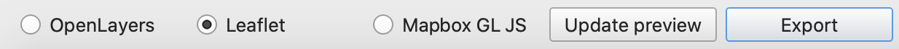

# Web Mapping from QGIS with Leaflet

### Purpose 

This exercise will teach you how to use the qgis2web plugin to create a Leaflet web map from QGIS.

### Software

The following software was used to complete this exercise:

* [QGIS 3.10](https://qgis.org/en/site/forusers/download.html) with [qgis2web plugin](https://github.com/tomchadwin/qgis2web/blob/master/README.md)

### Data

If you would like to follow along using the data from my webmap, download this [geopackage](dsGPKG.gpkg). If you would like to use your own data, the next step will instruct you how to prepare them for the web map.

### Preparing your Data

1) Add all of the desired geographic data to your canvas. Remove anything you don't want to add (you can also do this later, but getting rid of the useless data earlier doesn't hurt).
2) Make sure that any attribute information that you don't want online has been removed. This make you GeoJSON files smaller and make for shorter loading times. There are multiple ways to do this. One way is to go "**Properties**" > "**Fields**" and [select the pencil editor](photos/propertiesFields/png) and drop the unwanted fields using [delete field](photos/deleteField.png). Another way is to go "**Processing Toolbox**" > "**Vector tables**" > ["**Drop Fields**"](photos/dropFields.png) and use the drop fields tool to create a new layer without the unwanted fields.
3) Style all of your points with simple marker.
4) If you would like add a basemap, make sure your project CRS is set to WGS84/EPSG:4326. Although it would make seem that Pseudo Mercator/EPSG:3857 would work, I was unable to get the Leaflet web map to cooperate with this projection for the OSM Standard base map.

### Installing qgis2web

To install qgis2web, navigate to "**Plugins**" > ["**Manage and Install Plugins**"](photos/plugins.png) and search for "qgis2web" and install it.

### Using qgis2web

With all of your data prepared for mapping, navigate to "**Web**" > "**qgis2web**" > ["**Create Web Map**"](photos/plugins.png).

### Leaflet

Make sure that you have selected **Leaflet** as your output map format.

#### Layers and Groups

Here, you will will be deciding which layers will be visible upon opening the web map, which layers will have popups (and how they will be styled), and which layers will be cluster. If you would like a layer to be invisible on opening with no popups, [uncheck both boxes](photos/noVisnoPop.png). If you would like a layer to be visible and have popups, [check both boxse](photos/VisPop.png) and choose whether you want the attribute names to be in header (above) or inline (next to) format.

#### Appearance 

Here are the parameters I used in my [appearance tab](photos/Appearance.png).

#### Export 

I left these at their default setting

### Editing the .html file

Upon exporting, a folder will be saved in the same location that your .qgz/.qgs filed is saved. You can click on the index.html file to get an initial view of your map. 

To edit some features, such as your attributes and symbology, open up the html file in a text ediot (I used Moped on a Mac, Notepad++ is good for Windows).

