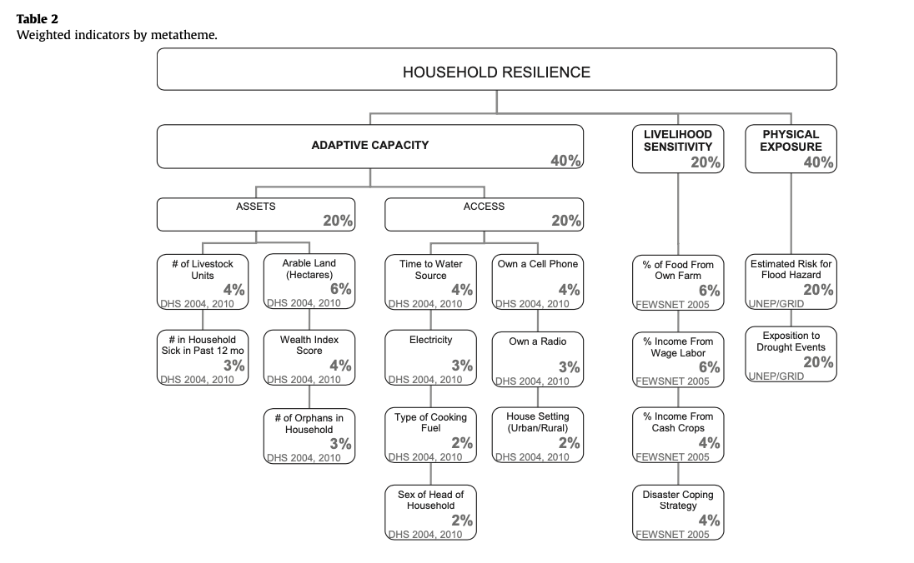
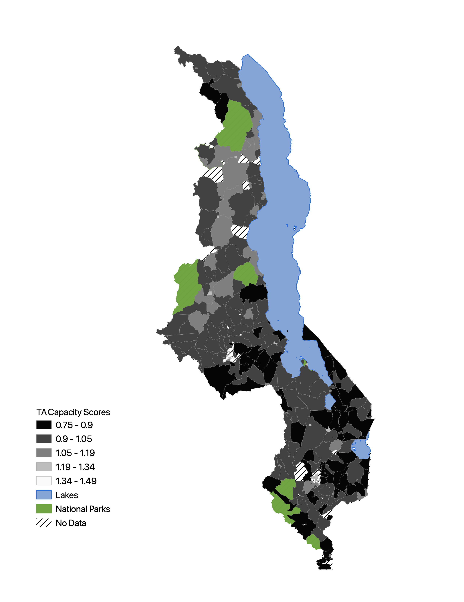

# Exploring Reproducibility and Replicability: Attempting to Reproduce Methodology of Vulnerability Analysis

### Background

Reproducibility and replicability of scientific research is becoming more widely recognized as an essential component of a robust scientific method in academic research. The National Academies of Sciences, Engineering, and Medicine defines and differenaties the two as such: *reproducibility* aims to obtain the same results by using the same input data and methodology while *replicability* aims to answer the same question using different different data and similar methodologies (2019). Adopting these processes in scientific research not only allows for a greater scrutiny of one's methodology but opens up new avenues of communication and transparency between researchers. Reproduciblity and replicabiltiy are instric to an open-science that not only allows for self-correction but sees it as beneficial to the scentific community as a whole (Sui 2014).

Applying these practices to climate change vulnerability research can be complicated by the confusion that surrounds vulnerability as a theoretical concept. Climate vulnerability is highly complex, contextual, and place-specific which makes it difficult to scale or replicate (Hinkel 2010). As a result of this, it is difficult for researchers and policy makers to agree upon a central, uniform approach to studying climmate vulnerability. Defining vulnerability not as an observable event but instead as a theoretical framework, Hinkel identifies the importance of developing an 'operational definition,' or a framing methodology, of any given vulernability analysis (2010). Using this framework, Hinkel encourages a critical engagement and interrogation of the methodological approaches used in vulnerability analyses.

### Purpose

The goal of this exercise is to reproduce and evaluate the methodologies Malcomb et al. has used to define and visualize climate vulnerability in Malawi. First, we will examine the methodology of Malcomb et al.'s analysis and use it to reproduce [Figure 4](photos/MalcombFig4.png) and [Figure 5](photos/MalcombFig5.png) from the research paper. Then, we will reflect upon the authors' methodological approach, bringing in literature on vulnerability analysis.

### Malcomb et al. Methodology for Household Resilience in Malawi

#### Goal

In their paper, Malcomb, Weaver, and Krakowka outline a new approach to modelling climate vulnerability in sub-Saharan Africa. Their vulnerability model employs a 'multi-scale, multi-indicator' approach to household-level climate vulnerability with the goal of providing both local actors and policy makers the ability to identify high risk areas and possibly solutions. They claim that their approach is both scalable and flexible so that it can be employed by other countries within sub-Saharan Africa. 

#### Methodology

Malcomb et al. use a multi-criteria weighted analysis to analyze and visualize social, economic, cultural, and environmental [vulnerability indicators](photos/indicators.png). These vulnerability indicators were divided into three sub-categories: adaptive capacity (composed of both assets and access), livelihood sensitivity, and physical exposure. Each of these vulnerability indicators were rescaled into quintiles: a 0 (worst) to 5 (best) scoring system. The authors used the following weighting scheme to produce a household resilience score for each Traditional Authority (TA: the scale of analysis, an administrative boundary just below districts): *Household Resilence = Adaptive Capacity(.4) + Livelihood Sensitivity(.2) + Physical Exposure (.2)*. 

<p align="center">
  
  </p>

### Reproducing Malcomb's Methodology and Figures

### Software

The following softwares were used to complete this exercise:

* [QGIS 3.10](https://qgis.org/en/site/forusers/download.html)
* [PostgreSQL with PGAdmin 4 v4.26](https://www.pgadmin.org/download/pgadmin-4-macos/)
* [RStudio](https://rstudio.com/products/rstudio/download/)

#### Data

We used the following data to reproduce Malcomb et al.'s methodology:

* [DHS Malawi Household Surveys](https://dhsprogram.com/methodology/Survey-Types/DHS.cfm): Access to this data requires an account and a formal request based on project
* [DHS Cluster Points](https://dhsprogram.com/methodology/GPS-Data-Collection.cfm): Household groupings where surveys were collected
* [DHS Survey Boundaries](http://spatialdata.dhsprogram.com/boundaries/#view=table&countryId=MW)
* [Flood and Drought Rasters](data/UNEP_rasters) from [UNEP GLobal Risk Data Platform](https://preview.grid.unep.ch/index.php?preview=map&lang=eng)
* [Livelihood Zones](data/LivelihoodZones.zip) from [FEWSnet](https://fews.net/fews-data/335)
* [Traditional Authority Shapefile](data/TA.zip): Gathered from [GADM](https://gadm.org/)
* [OSM Malawi Lakes](data/MajorLakes.zip) from [MASDAP](http://www.masdap.mw/layers/geonode:major_lakes)
* [National Parks](data/NationalParks.zip) from [Protected Planet](https://www.protectedplanet.net/country/MWI)

#### Calculating Adapative Capacity Scores

To get the DHS data into a PostGIS database, we used this [R script](scripts/rtranscript.r) written by Professor Holler. This script is meant to write SPSS files into a Postgres database, so be sure to downlaod the DHS data as an SPSS file (if you have access).

The following [sql code](scripts/vulnerabilitySQL.sql) was written to convert the DHS household criteria into composite capacity scores. I will provide a commented walk-through of the code and emphasize areas that problematize the reproducibility Malcomb et al.'s methodology

Identify urban areas from DHS clusters and join to DHS survey data:
```sql
/* codes
household id: hhid
cluster id:
livestock: HV246a + hv246a + hv246d + hv246e + hv246g
sick: hv248
land: hv245
wealth: hv271, or should it have been hv270 (already on scale of 5?)
orphans: hv251
watertime: hv204
electricity: hv206
cookingfuel: hv226
gender: hv219
cellphone: hv243a
radio: hv207
urban: joined from DHS clusters
*/

/* Identify the TA each cluster is in to find which clusters are urban or rural and join to dhs table */
update mwita set geom = 
st_makevalid(geom)
where not st_isvalid(geom)

alter table dhsclusters add column ta_id integer;
update dhsclusters set ta_id = mwita.id from mwita where st_intersects(mwita.geom, dhsclusters.geom);

select count(name2_), count(distinct name2_) from mwita;
--the TA names are not unique! Use the ID instead...

alter table dhshh1010 add column ta_id integer;
update dhshh1010 set ta_id = dhsclusters.ta_id from dhsclusters where dhsclusters.dhsclust = dhshh1010.hv001;

alter table dhshh10 add column urbanrural varchar(1);
update dhshh10 set urbanrural = dhsclusters.urban_rura from dhsclusters where dhsclusters.dhsclust = dhshh10.hv001;

create table mwi as
select st_union(st_makevalid(geom))::geometry('multipolygon',4326) from mwita;
``` 

Get rid of null values or missing data:
```sql--originally having 24825 records
DELETE FROM dhshh1010 WHERE
hv246a=98 or
hv246a=99 or
hv246d=98 or
hv246d=99 or
hv246e=98 or
hv246e=99 or
hv246g=98 or
hv246g=99 or 
hv219=9 or
hv243a=9 or
hv245=99 or
hv206=9 or
hv204=999 or
hv204=998 or
hv226=99 or		 --no cooking data
hv226=95 or 	    --no cooking
hv226=96 or		   --cooking with 'other' fuel
HV207=9;
--deleted 156 household records with missing data for our purposes
--resulting in ## records
```

Combine different livestock into one column and show with percent rank:
```sql
/*count livestock*/
ALTER TABLE dhshh1010 ADD COLUMN hhlivestock INTEGER;
UPDATE dhshh1010 SET hhlivestock = hv246a + hv246d + hv246e + hv246g;

/*illustrate with percent_rank() and ntile()*.
select hhlivestock,
(percent_rank() OVER(ORDER BY hhlivestock asc) * 4) + 1 as pctRtimes4plus1,
percent_rank() OVER(ORDER BY hhlivestock asc) as pctRank,
ntile(5) over(order by hhlivestock asc) as ntile5
from
dhshh1010
```

Here is a small subset of our code to convert the household level data to quintiles. This was one of the more difficult portions of the methodology to reproduce. While Malcomb et al. explains that they reclassified these sets of data into quntiles from 0 to 5 (notwithstanding the fact that 0 to 5 actually represents 6 classes), they did not explain in detail the decision making processes that went into these classifications. Further, 5 of the 12 household variables were represented either a 0 or 1 score, and there was no explanation as to how these variables were weighted nor any justification for the decision to use quintiles.

```sql
/* Standardizing to scale of 1 (low capacity) to 5 (high capacity) */
/*  ORDER BY DESC will make high values to recieve a low score
	ORDER BY ASC will make low values to receive a low score  */

ALTER TABLE dhshh10 ADD COLUMN livestock REAL;
UPDATE dhshh1010 set livestock = pctr FROM
(SELECT hhid as shhid, percent_rank() OVER(ORDER BY hhlivestock asc) * 4 + 1 as pctr FROM dhshh10 ) as subq
where hhid=shhid;

ALTER TABLE dhshh1010 ADD COLUMN sick REAL;
UPDATE dhshh1010 set sick=pctr from
(SELECT hhid as shhid, percent_rank() OVER(ORDER BY hv248 desc) * 4 + 1 as pctr FROM dhshh10 ) as subq
where hhid=shhid;
--ORDER THIS DESC because if MANY people were sick they need a LOW capacity score

ALTER TABLE dhshh1010 ADD COLUMN land REAL;
UPDATE dhshh1010 set land=pctr from
(SELECT hhid as shhid, percent_rank() OVER(ORDER BY hv245 asc) * 4 + 1 as pctr FROM dhshh10 ) as subq
where hhid=shhid;
--See code to observe how the rest of the non-binary variables were reclassified

/* The following code shows how the binary (0 or 1) variables were given their scores */
ALTER TABLE dhshh10 ADD COLUMN sexcat REAL;
UPDATE dhshh10 set sexcat=
	CASE
		WHEN hv219 = 1 THEN 5
		ELSE 1
	END;

ALTER TABLE dhshh10 ADD COLUMN cellphone REAL;
UPDATE dhshh10 set cellphone=
	CASE
		WHEN hv243a = 1 THEN 5
		ELSE 1
	END;

ALTER TABLE dhshh10 ADD COLUMN radio REAL;
UPDATE dhshh10 set radio=
	CASE
		WHEN hv207 = 1 THEN 5
		ELSE 1
	END;

ALTER TABLE dhshh10 ADD COLUMN urbanruralscore REAL;
UPDATE dhshh10 set urbanruralscore =
	CASE
		WHEN urbanrural = 'U' THEN 4
		ELSE 3
	END;
```

From here, the scores were weighted from a scale of .4 to 2.0 scale so that the final household resilience calculation (including the other elements) would scale from 0 to 5.

```sql 
/* Create a composite household capacity score, on scale from 0.4 to 2 */
ALTER TABLE dhshh10 ADD COLUMN capacity REAL;
UPDATE dhshh10 SET capacity =
(livestock*0.04+
sick*0.03+
land*0.06+
wealth*0.04+
orphans*0.03+
water*0.04+
electricity*0.03+
cooking*0.02+
sexcat*0.02+
cellphone*0.04+
radio*0.03+
urbanruralscore*0.02);

CREATE VIEW tacapacity AS
SELECT ta_id, count(capacity) as hhcount, avg(capacity) as capacityavg, min(capacity) as capacitymin, max(capacity) as capacitymax, stddev(capacity) as capacitystddev
FROM dhshh10
GROUP BY ta_id;

ALTER TABLE mwita ADD COLUMN capacity REAL;
UPDATE mwita SET capacity = capacityavg
FROM tacapacity
WHERE tacapacity.ta_id = mwita.id

CREATE TABLE capacity AS 
SELECT ST_AsRaster(mwita.geom, (select rast from drought limit 1), '32BF', mwita.capacity, -9999) as rast
FROM mwita
where capacity is not null
```

Below is our replication of [Figure 4](photos/MalcombFig4.png). Despite being created from the same exact data, It has not been reproduced exactly as the variables are scored with a different scale and that difference is not merely one in magnitude but

<p align="center">
  
  </p>


### Results

### Discussion

### Resources

Hinkel, J. (2011). “Indicators of vulnerability and adaptive capacity”: towards a clarification of the science–policy interface. Global Environmental Change, 21(1), 198-208. https://doi.org/10.1016/j.gloenvcha.2010.08.002

Malcomb, D. W., Weaver, E. A., & Krakowka, A. R. (2014). Vulnerability modeling for sub-Saharan Africa: An operationalized approach in Malawi. Applied geography, 48, 17-30. https://doi.org/10.1016/j.apgeog.2014.01.004

National Academies of Sciences, Engineering, and Medicine. 2019. Reproducibility and Replicability in Science. Washington, DC: The National Academies Press. doi: https://doi.org/10.17226/25303.

Sui, D. 2014. Opportunities and impediments for Open GIS. *Transactions in GIS,* 18(1); 1-24. doi: 10.1111/tgis.12075

Tate, 
