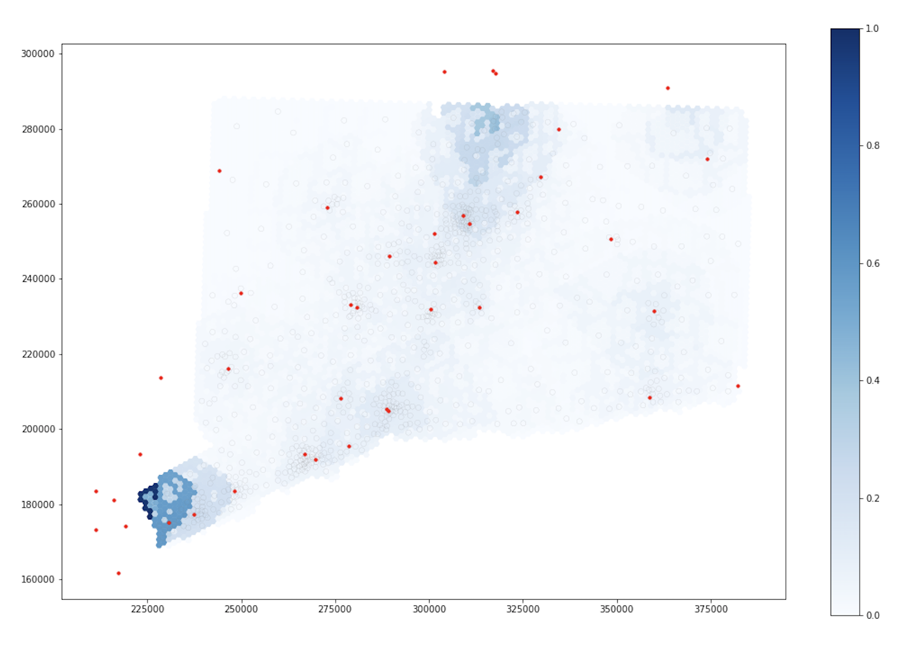
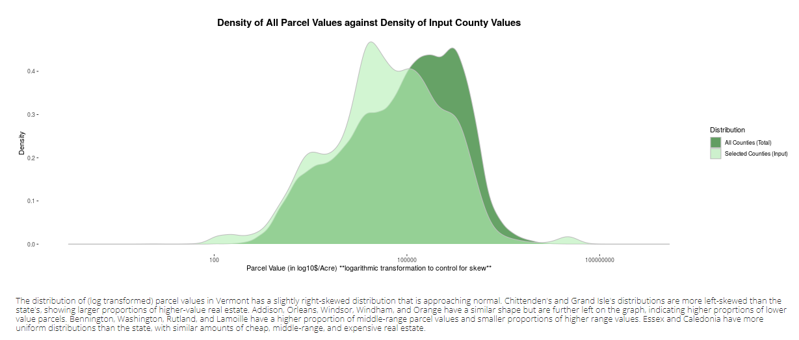
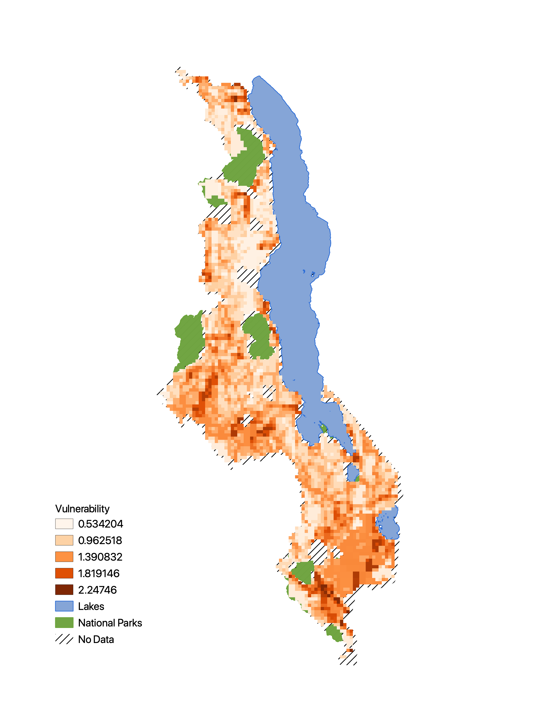
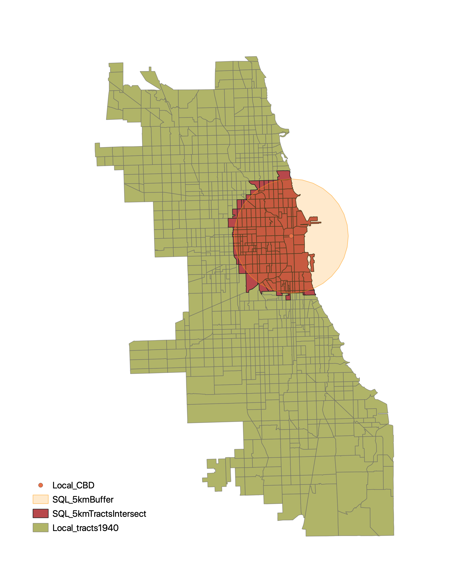
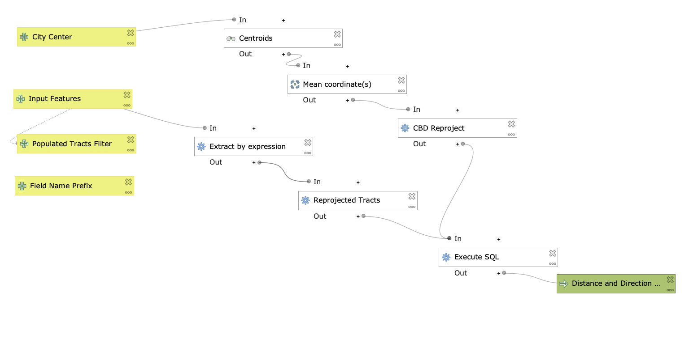

## [CyberGISX Jupyter Notebooks: Replicating Spatial Accessibility Analysis of Covid-19 Healthcare Resources](ctCovid/ctCovid.md)
The purpose of this exercise is to replicate Kang et al's methodology, using a Jupyter Notebook on their CyberGISX platform, to calulate spatial accessibility of COVID-19 healthcare resources in Connecticut. I will briefly summarize their methodology, walk through the process of acquiring and processing the necessary data for Connecticut, show and explain the code modifications that were made to Kang et al's Notebook for this replication, explain the results, and comment on the methodology and the process of replication.  

   

## [Interactive Data Viz with R Shiny: Vermont Parcel Values](vtParcels/vtParcels.md)
This post shares the data and code for my [Vermont Parcel Values App](https://derrickburt.shinyapps.io/VTparcels/). This app creates interactive visualizations of 2020 Vermont parcel values, allowing users to explore the distributions of land value in Vermont. Detailed descriptions of the methodology and data are described in the app.

   

## [Spatial and Temporal Analysis of Hurricane Dorian Tweets](twitter/twitter.md)
The purpose of this exercise is to analyze the geographic and temporal distribution of Tweets in the Eastern United States during Hurricane Dorian. In the process of this, we will cover a number off things. First, we will practice scraping twitter data in R using rtweet, cleaning it, and visualizing its temporal trends and performing sentiment analysis. Then, we will send the data to a PostGIS database to join it to county level data and count the level of tweets by county. Then, we will visualize the data with a heatmap of raw tweets and a choropleth of the NDTI (Normalized Tweet Difference Index). Finally, we will use GeoDa to perform a spatial hotspot analysis. Additionally, one of the motivating factors behind this lab was to see if there was a rise in Dorian-related tweets in Alabama after the “sharpie-gate” incident.

   

## [Reproducing Climate Vulnerability GIS Analysis in Malawi](malawi/index.md)
The goal of this exercise is to reproduce and evaluate the methodologies Malcomb et al. used to measure and visualize climate vulnerability in Malawi. First, we will examine the methodology of Malcomb et al.’s analysis and use it to reproduce Figure 4 and Figure 5 from the research paper. Then, we will reflect upon the authors’ methodological approach, bringing in literature on vulnerability analysis.

   

## [Making a Leaflet Web Map From QGIS](leaflet/leaflet.md)
This exercise will teach you how to use the qgis2web plugin to create a Leaflet web map from QGIS.

<embed src="https://derrickburt.github.io/opengis/leaflet/dsmmap/index.html#10/-6.8772/39.2834" style="width:500px; height: 300px;">

## [Resilience Academy in Dar es Salaam: Analyzing Public Transportation Access in PostGIS](sql/DSlab/DSLAB.md)
The goal of this lab is to utilize the data produced by Ramani Huria to quantify and visualize residential access to public transportation stops in Dar es Salaam.  I have chosen to focus on public transportation access because Dar es Salaam is one of the fastest growing cities in the world, which makes it difficult for urban planners to adequately support an evolving cityscape. In 2014, public transportation occupied approximatley 68% of the resident’s mobility share (Mkalawa and Haixiao 2014). Given the importance of public transportation to the city’s residents, a meaningful analysis of the spatial distribution of access could be a helpful tool for planners.

   

## [Introduction to Spatial SQL with PostGIS/PostgreSQL](sql/introSQL/introSQL.md)
This exercise offers an introduction Structed Query Language (SQL) in a postgis database. PostgreSQL is a open-source software that allows for spatial data to be stored, accessed, updated, and analyzed in a relational database context. There are a number of advantages of using PostGIS that range from efficiency by way of indexing to allowing multiple users to simultaneously update and work with data in a GIS. This Medium article effectively communicates the benefits of doing GIS in such an environment. This exercise will introduce some basic managment and analysis techniques in PostGIS.

   

## [Modelling Distance and Direction in QGIS](qgisModel/qgisModel.md)
In this lab we will build a model using open source tools to calculate and visualize the distance and direction of census tracts from the central business district of a city. Further analyses on the data were also done to understand the demographic structure of the city. This can be a useful tool to test geographic theories of urban growth. 

   

## [FOSS4G Conference Article Review](blog/foss4greview.md)
An article review of Ostadabbas' et al. article, "Database transformation, cadastre automatic data processing in qgis and implementation in web GIS."
