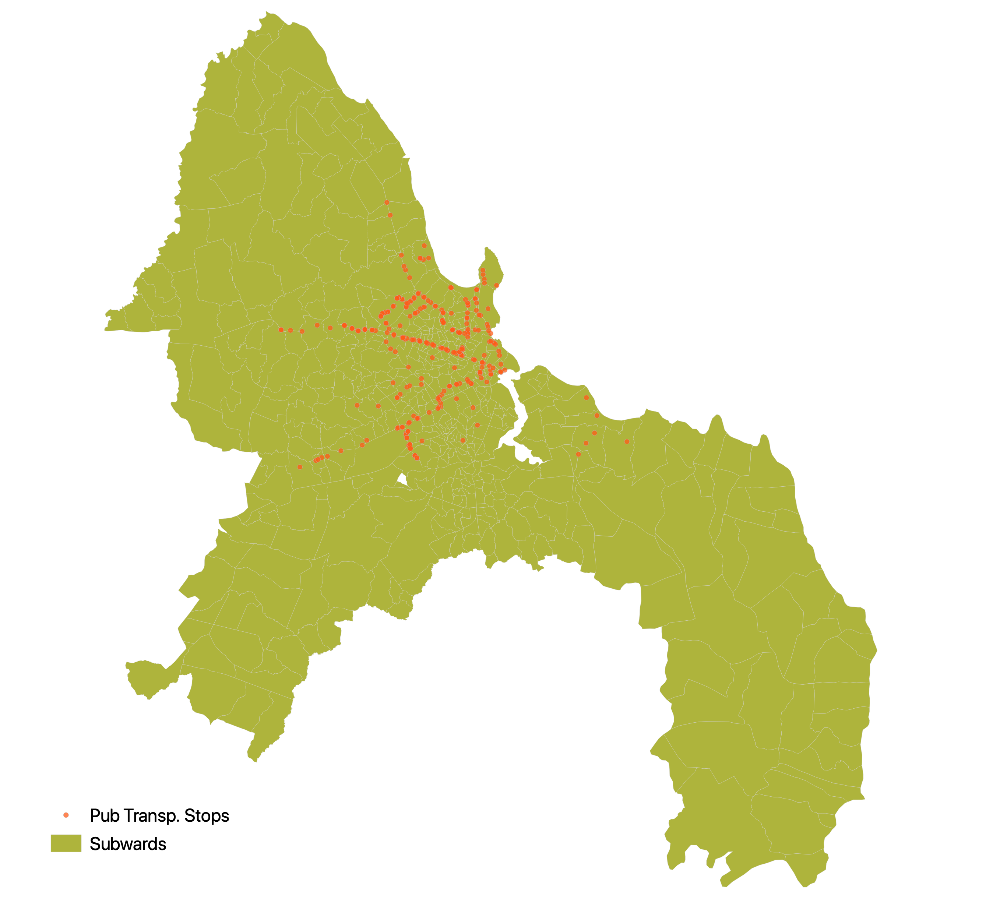
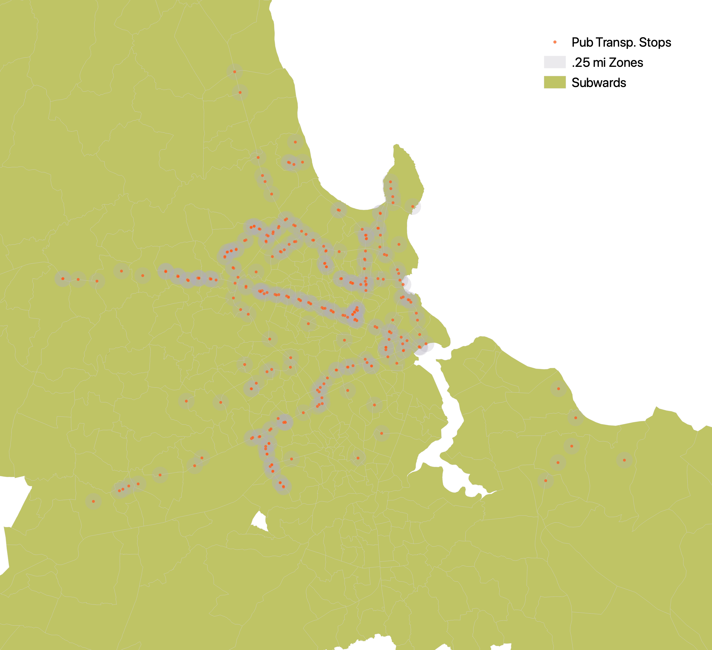
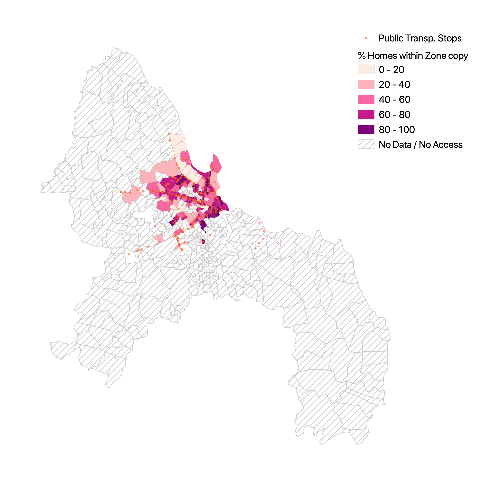
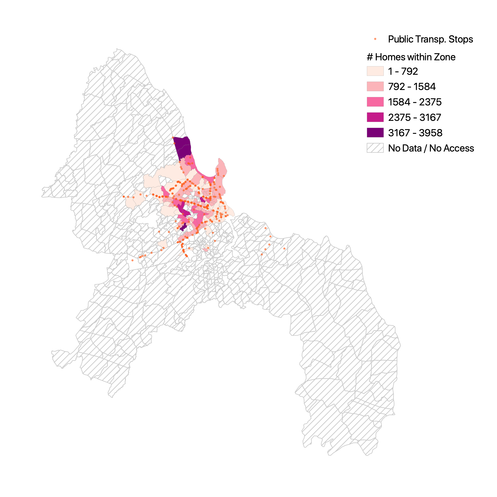

# Resilience Academy in Dar es Salaam: 
## Visualizing Public Transportation Access with Spatial SQL and OpenStreetMap

### Background 

 

Tanzania's [Resilience Academy](https://resilienceacademy.ac.tz/about-us/) is a partnership between four Tanzanian university's that aims to build urban climate resilience by expanding climate data, establishing mapping initiatives, digital learning, and research initiatives. [Ramani Huria](https://ramanihuria.org/en/), one of the Resilience Academy's initiatives, is a community mapping program that uses OpenStreetMap to produce highly detailed spatial data throughout Dar es Salaam to support flood resiliency and urban planning.

### Purpose

The goal of this lab is to utilize the data produced by Ramani Huria to quantify and visualize residential access to public transportation stops in Dar es Salaam. Typically, it would be difficult to perform such a granular GIS analysis of an entire city. With the openly available, community-collected data from Ramani Huria, however, we are able to analyse the urban infrastucture of Dar es Salaam with highly localized, large scale data. I have chosen to focus on public transportation access because Dar es Salaam is one of the [fastest growing cities](https://www.nationalgeographic.com/environment/2019/04/tanzanian-city-may-soon-be-one-of-the-worlds-most-populous/) in the world, which makes it difficult for urban planners to adequately support an evolving cityscape. In 2014, public transportation occupied approximatley 68% of the resident's mobility share (Mkalawa and Haixiao 2014). Given the importance of public transportation to the city's residents, a meaningful analysis of the spatial distribution of access could be a helpful tool for planners.

In this post, readers will be provided with directions and code to both acquire the data and reproduce the analysis.

### Accessing Data

#### Resilience Academy
The subwards and public transportation stops can be found on the Resilience Academy's web feature service. This can be accessed from QGIS by locating 'WFS' in the 'Browser', right-clicking to add a 'New Connection...' and entering this url: https://geonode.resilienceacademy.ac.tz/geoserver/ows. Both the subwards and the public transportation stops can be loaded into a PostGIS database by selecting 'Add Layer to Project' and then loading them into a database using the directions outlined in the 'Connecting to PostGIS in QGIS and Loading Data' sectiong of my last [blog post](https://github.com/derrickburt/derrickburt.github.io/blob/master/SQL/introSQL/introSQL.md).

### Loading OpenStreetMap data into PostGIS with OSM2PGSQL (Directions provided for Mac and Windows)

#### Windows 
This set of [directions](scripts/osm2pgsqlPCdirections.txt) written by Professor Holler will direct you how to use this [batch script](scripts/convertOSM.bat) along with this [style file](scripts/dsm.style) on a PC.

#### Mac
For Mac user, this set of [directions](scipts/osm2pgsqlMACOS.txt) will teach you how to install osm2pgsql on your computer with homebrew, and then load osm data into a postgis database. This [style file](scripts/dsm.style) and [.osm of subset data](scripts/small_map.osm) will be needed to run the terminal script. While an .osm file of Dar es Salaam is too large to upload to this page, they can be installed following these [directions](https://wiki.openstreetmap.org/wiki/Downloading_data). 

### Analysis

I will provide step-by-step directions of the sql code used in this analysis, but here is the entire [script](scripts/queriesDS.sql)

<p align="center">
 
  </p>

#### 1) Prepare residential polygons and points for analysis 

```sql
/* Select residential buildings */
CREATE TABLE res_osm_polygon AS
SELECT osm_id, building, ST_TRANSFORM(way, 32737) as geom 
FROM planet_osm_polygon
WHERE building = 'residential'

CREATE TABLE res_osm_point AS
SELECT osm_id, building, ST_TRANSFORM(way, 32737) as geom 
FROM planet_osm_point 
WHERE building = 'residential'

/* The polygons have duplicates, so they will need to be deleted before creating a primary key */
SELECT osm_id, COUNT( osm_id )
FROM res_osm_polygon
GROUP BY osm_id
HAVING COUNT( osm_id )> 1
ORDER BY osm_id;
SELECT osm_id, COUNT( osm_id )
FROM res_osm_point
GROUP BY osm_id
HAVING COUNT( osm_id )> 1
ORDER BY osm_id;

/* Populate respective geometry columns and Add primary key*/
SELECT populate_geometry_columns('public.res_osm_polygon'::regclass);
ALTER TABLE res_osm_polygon ADD PRIMARY KEY (osm_id)

SELECT populate_geometry_columns('public.res_osm_point'::regclass);
ALTER TABLE res_osm_point ADD PRIMARY KEY (osm_id)
```

#### 2) Get rid of duplicates (buildings counted as both points and polygons)

```sql
/* Get rid of residential points that were also counted as residential polygons */
/* Create column*/
ALTER TABLE res_osm_point ADD COLUMN duplicate INTEGER;
UPDATE res_osm_point
SET duplicate = 1
FROM res_osm_polygon
WHERE ST_INTERSECTS(res_osm_point.geom, res_osm_polygon.geom)

/* Delete the points that overlap the polygons */
DELETE FROM res_osm_point
WHERE duplicate = 1
```

#### 3) Convert residential polygons to points, and join with other set of residential points

```sql
/* Convert residential polygons to centroids and union with residential points */
CREATE TABLE res_union AS
SELECT osm_id, building, ST_CENTROID(geom) AS geom
FROM res_osm_polygon
UNION 
SELECT osm_id, building, geom 
FROM res_osm_point

/* Populate geometry column, Add primary key, Create spatial index */
SELECT populate_geometry_columns('public.res_union'::regclass);
ALTER TABLE res_union ADD PRIMARY KEY (osm_id)
```

#### 4) Count how many residential buildings are in each subward

```sql
/* Count how many residential buildings are in each subward */
CREATE TABLE subwards_join AS
SELECT
ds_subwards.fid as fid, ds_subwards.ward_name as ward_name, ds_subwards.geom as geom1,
COUNT(osm_id) as total_ct
FROM ds_subwards 
JOIN res_union 
ON ST_Intersects(ds_subwards.geom, res_union.geom)
GROUP BY ds_subwards.fid, ds_subwards.ward_name

/* Populate geometry column, Add primary key, Create spatial index */
SELECT populate_geometry_columns('public.subwards_join'::regclass);
ALTER TABLE subwards_join ADD PRIMARY KEY (fid)
```

#### 5) Count how many residential buildings are within .25 mile of a public transportation stop

```sql
/* Create a column of buildings that are within a .25 mi of BUFFER stop points */
ALTER TABLE res_union ADD COLUMN res_access INTEGER;
UPDATE res_union
SET res_access = 1
FROM ds_stops
WHERE ST_DWITHIN(res_union.geom, ds_stops.geom, 402.33)

/* Create a table where only the tracts within the buffer zone are included */
CREATE TABLE res_within_stopzone AS
SELECT *
FROM res_union
WHERE res_access = 1


/* Populate geometry column, Add primary key, Create spatial index */
SELECT populate_geometry_columns('public.res_within_stopzone'::regclass);
ALTER TABLE res_within_stopzone ADD PRIMARY KEY (osm_id)
```
<p align="center">
  
  </p>


#### 6) Join the residential points within the stop zone to stopwards, count totals, and calculate percentages

```sql 
/* Join the res_access column to the subwards containing total res building counts, count # of buildings with access */
CREATE TABLE subwards_final AS
SELECT a.fid, a.geom1, a.total_ct,
COUNT(b.res_access) as stops_access
FROM subwards_join a
JOIN res_within_stopzone b
ON ST_Intersects(a.geom1, b.geom)
GROUP BY a.fid

/* Populate geometry column, Add primary key, Create spatial index */
SELECT populate_geometry_columns('public.subwards_final'::regclass);
ALTER TABLE subwards_final ADD PRIMARY KEY (fid)

/* Calculate Percentages */
ALTER TABLE subwards_final ADD COLUMN pct_access DOUBLE PRECISION;
UPDATE subwards_final
SET pct_access = (stops_access * 1.0/total_ct) * 1000;
```
<p align="center">
  
  </p>

<p align="center">
  
  </p>
  
### Leaflet Visualization

To allow for a scalable and interactive visualization of this analysis, I have made a [leaflet web map](leaflet/dsmmap/index.html). I have also provided some basic directions on how to publish a web map from qgis in the [following blog post](leaflet/leaflet.md).

### Discussion

Perhaps the most immediate takeway analysis rather intuitive; the subwards with the highest proportions of residences within quarter mile zones of public transportation stops are those that appear to be situated along the bus routes. The subwards on the fringe of the central region of Dar es Salaam, those further away from the public transportation routes and along the coast, have shockingly low (often under 5%) proximate access to public transportation stops. Yet, some of these subwards are home to as many as 2,500 to 3,500 residential buildings. These disparities in transportation access are likely explained by the inability of urban planners to keep up with the city's population growth (Mkalawa and Haixiao 2014). A more comprehensive analysis of these trends should explore the spatial patterns of population growth to see if the subward's with poorer access to public transportation stops are those which have seen the most growth. 

Another important aspect that should be considered when understandingt his analysis is the source of the data and acknowledge both the impressive depth at which it highlights certain portions of Dar es Salaam and simultaneously a lack of breadth in which much of the city's outskirts are left out of this analysis. It is clear from the maps that the concentration of reliable data in the city's center. While it is likely that there is greater population density in the center of the city Mkalawa and Haixiao 2014), it is clear that the data collection efforts of Ramani Huria, as comprehensive as they are, have remained within the more central location of the city. While it is valuable to have free access to an impressively detailed set of data, we should recognize this data as a work in progress and not a final and static representation of the city. Often times the quality of data can be taken for granted or simply assumed (Schuurman 2008). I do not mean to imply that Ramani Huria has done a poor job with their data collection but instead highlight the aspects of the data that are not shown in the maps produced by this workflow. Because the scale of this project is massive, there are some inconsitencies (such as a variation in the attributes and tags attached to building shapefiles or the issue of buildings being counted twice) that should be acknowledged so that we are honest in the (in)accuracies of our representations. Thus, even when using institutionally-derived data, it is important to interrogate the methodologies of the data collection and be transparent about its limitations.

### Resources

Mkalawa C.C. & Haixiao, P. (2014). Dar es Salaam city temporal growth and its influence on transportation. *Urban, Planning and Transport Research, 2:1, 423-446, DOI: 10.1080/21650020.2014.978951

Schuurman, N. (2008). Database ethnographies using social science methodologies to enhance data analysis and interpretation. *Geography Compass, 2(5), 1529-1548. https://doi.org/10.1111/j.1749-8198.2008.00150.x
