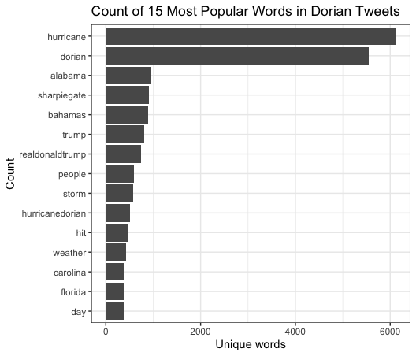
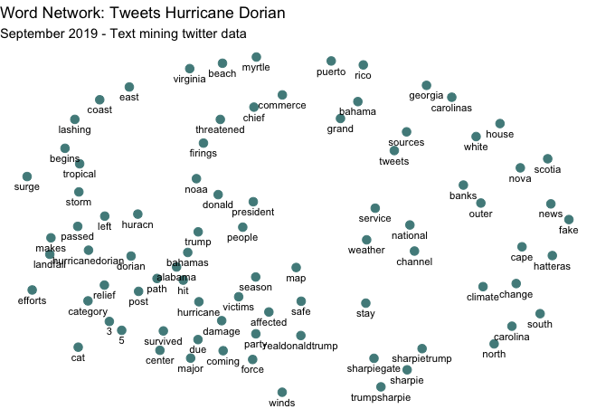
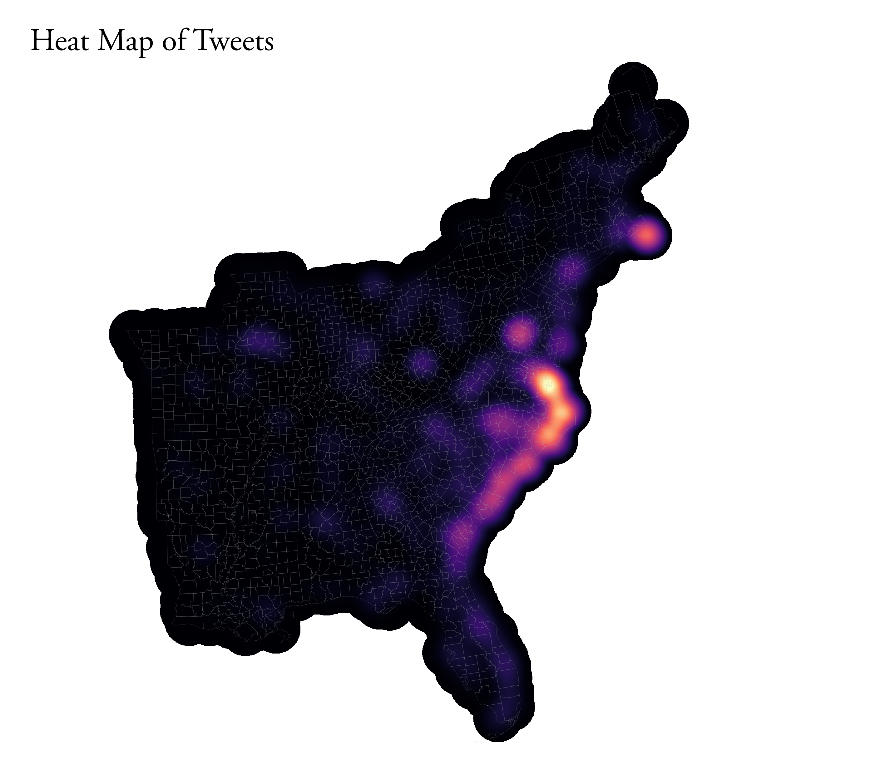
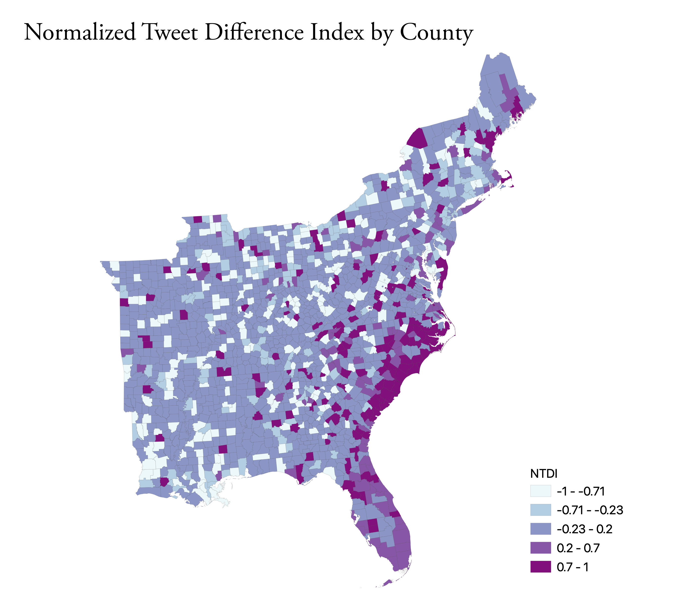

# Spatial and Temporal Analysis of Twitter Activity during Hurricane Dorian

### Purpose

The purpose of this exercise is to analyze the geographic and temporal distribution of Tweets in the Eastern United States during Hurricane Dorian. In the process of this, we will cover a number off things. First, we will practice scraping twitter data in R using [rtweet](https://cran.r-project.org/web/packages/rtweet/rtweet.pdf), cleaning it, and visualizing its temporal trends and performing sentiment analysis. Then, we will send the data to a PostGIS database to join it to county level data and count the level of tweets by county. Then, we will visualize the data with a heatmap of raw tweets and a choropleth of the NDTI (Normalized Tweet Difference Index). Finally, we will use GeoDa to perform a spatial hotspot analysis.

### Software

The following softwares were used to complete this exercise:

* [QGIS 3.10](https://qgis.org/en/site/forusers/download.html)
* [PostgreSQL with PGAdmin 4 v4.26](https://www.pgadmin.org/download/pgadmin-4-macos/)
* [RStudio](https://rstudio.com/products/rstudio/download/)
* [GeoDa](https://geodacenter.github.io/download.html)

### Data

Some of the relevant data for this project will be acquired (with explanation) while the scripts are run. Other data, specifically the actualy twitter content, requires a Twitter API (developer account) to use.

You can download the status ID's for the tweets analyzed in this exercise here:
* [Dorian Tweets](data/dorianData.csv)
* [November Tweets](data/novemberData.csv)

### Twitter Content Analysis in R

The first portion of this analysis consists of scraping twitter data into R and performing some analyses of the twitter content. You can download the entire [R script](scripts/dorianTwitter.R) but I will walk through some of the code as well.

Once you have installed the necesarry packages and loaded them into you library, you can load your API information into R and start scraping twitter data. This requires an API and you can only scrape tweets from the past week.

<details><summary markdown="span"> Code: </summary>
  
```r
#set up twitter API information // #replace app, consumer_key, and consumer_secret data with your own developer acct info
#this should launch a web browser and ask you to log in to twitter
twitter_token <- create_token(
  app = "name",  					
  consumer_key = "key",  	
  consumer_secret = "secret", 
  access_token = "token",
  access_secret = "secret"
)

#get tweets for hurricane Dorian, searched on September 11, 2019
dorian <- search_tweets("dorian OR hurricane OR sharpiegate", 
                        n=200000,
                        include_rts=FALSE, 
                        token=twitter_token, 
                        geocode="32,-78,1000mi", 
                        retryonratelimit=TRUE)
```

</details>
<br/>

Once you have saved the data into your environment, you can begin analyzing and visualizing the twitter content. Here, we will clean the tweets to only include plain text, unnest them (make rows out of individual words instead of rows of whole tweets), remove the stopwords, and visualize the most used words related to the hurricane.

<details><summary markdown="span"> Code: </summary>
  
```r
dorian$text <- plain_tweets(dorian$text)

dorianText <- select(dorian,text)
dorianWords <- unnest_tokens(dorianText, word, text)

# how many words do you have including the stop words?
count(dorianWords)

#create list of stop words (useless words) and add "t.co" twitter links to the list
data("stop_words")
stop_words <- stop_words %>% add_row(word="t.co",lexicon = "SMART")

dorianWords <- dorianWords %>%
  anti_join(stop_words) 

# how many words after removing the stop words?
count(dorianWords)

orianWords %>%
  count(word, sort = TRUE) %>%
  top_n(15) %>%
  mutate(word = reorder(word, n)) %>%
  ggplot(aes(x = word, y = n),
         fill = "darkslategray4") +
  geom_col() +
  xlab(NULL) +
  coord_flip() +
  labs(x = "Count",
       y = "Unique words",
       title = "Count of 15 Most Popular Words in Dorian Tweets") +
  theme(plot.title = element_text(hjust = 0.5),
        axis.text.y = element_text(size = 1)) +
  theme_bw()
```

</details>
<br/>

<p align="center">
  
  </p>
  
The next visualization will pair words in a word cloud that have been used in over 30 tweets together

<details><summary markdown="span"> Code: </summary>
  
```r
#create word pairs
dorianWordPairs <- dorianWords %>% select(word) %>%
  mutate(word = removeWords(word, stop_words$word)) %>%
  unnest_tokens(paired_words, word, token = "ngrams", n = 2)

dorianWordPairs <- separate(dorianWordPairs, paired_words, c("word1", "word2"),sep=" ")
dorianWordPairs <- dorianWordPairs %>% count(word1, word2, sort=TRUE)

#graph a word cloud with space indicating association. you may change the filter to filter more or less than pairs with 10 instances
dorianWordPairs %>%
  filter(n >= 30) %>%
  graph_from_data_frame() %>%
  ggraph(layout = "fr") +
  geom_node_point(color = "darkslategray4", size = 3) +
  geom_node_text(aes(label = name), vjust = 1.8, size = 3) +
  labs(title = "Word Network: Tweets Hurricane Dorian",
       subtitle = "September 2019 - Text mining twitter data ",
       x = "", y = "") +
  theme_void()
```

</details>
<br/>

<p align="center">
  
  </p>

### Spatial Analysis in Postgis

From R, you can connect to your PostGIS database and upload the twitter data. You can also get a [census API](https://api.census.gov/data/key_signup.html) and, using the rcensus package, upload that data into R and then send it into a PostGIS database.

<details><summary markdown="span"> Code: </summary>

```r
#Connectign to Postgres
#Create a con database connection with the dbConnect function.
#Change the database name, user, and password to your own!
con <- dbConnect(RPostgres::Postgres(), 
                 dbname='yourname', 
                 host='yourhost', 
                 user='youruser', 
                 password='yourpassword*') 

#list the database tables, to check if the database is working
dbListTables(con) 

#create a simple table for uploading
dorain <- select(dorain,c("user_id","status_id","text","lat","lng"),starts_with("place"))

#write data to the database
#replace new_table_name with your new table name
#replace dhshh with the data frame you want to upload to the database 
dbWriteTable(con,'dorain',dorian, overwrite=TRUE)
dbWriteTable(con,'november',november, overwrite=TRUE)

#SQL to add geometry column of type point and crs NAD 1983: 
#SELECT AddGeometryColumn ('public','winter','geom',4269,'POINT',2, false);
#SQL to calculate geometry: update winter set geom = st_transform(st_makepoint(lng,lat),4326,4269);

#get a Census API here: https://api.census.gov/data/key_signup.html
#replace the key text 'yourkey' with your own key!
Counties <- get_estimates("county",
                          product="population",
                          output="wide",
                          geometry=TRUE,
                          keep_geo_vars=TRUE, 
                          key="yourkey")

#make all lower-case names for this table
counties <- lownames(Counties)
dbWriteTable(con,'counties',counties, overwrite=TRUE)
#SQL to update geometry column for the new table: select populate_geometry_columns('westcounties'::regclass);

#disconnect from the database
dbDisconnect(con)
```

</details>
<br/>

With the twitter data and county-level data in R, you can begin. Here is the full [SQL script](scripts/sqlDorian.sql) I wrote to work clean, join, and perform the calculations on this data.

<details><summary markdown="span"> Code for Cleaning and Reprojecting to USA Contiguous Lambert Conformal Conic: </summary>
  
```sql
/* Add a projected coordinate system to your database (will need it for twitter data) */
INSERT into spatial_ref_sys (srid, auth_name, auth_srid, proj4text, srtext) values ( 9102004, 'esri', 102004, '+proj=lcc +lat_1=33 +lat_2=45 +lat_0=39 +lon_0=-96 +x_0=0 +y_0=0 +ellps=GRS80 +datum=NAD83 +units=m +no_defs ', 'PROJCS["USA_Contiguous_Lambert_Conformal_Conic",GEOGCS["GCS_North_American_1983",DATUM["North_American_Datum_1983",SPHEROID["GRS_1980",6378137,298.257222101]],PRIMEM["Greenwich",0],UNIT["Degree",0.017453292519943295]],PROJECTION["Lambert_Conformal_Conic_2SP"],PARAMETER["False_Easting",0],PARAMETER["False_Northing",0],PARAMETER["Central_Meridian",-96],PARAMETER["Standard_Parallel_1",33],PARAMETER["Standard_Parallel_2",45],PARAMETER["Latitude_Of_Origin",39],UNIT["Meter",1],AUTHORITY["EPSG","102004"]]');

/* Add geometry column to twitter data */
ALTER TABLE dorian ADD COLUMN geom geometry;
ALTER TABLE november ADD COLUMN geom geometry;

/* Create points for twitter data, reproject, and populate geometry columns */
UPDATE dorian
SET geom = ST_TRANSFORM( ST_SETSRID( ST_MAKEPOINT(lng, lat), 4326), 102004);
SELECT populate_geometry_columns('dorian'::regclass);

UPDATE november
SET geom = ST_TRANSFORM( ST_SETSRID( ST_MAKEPOINT(lng, lat), 4326), 102004);
SELECT populate_geometry_columns('november'::regclass);

/* Counties should be imported from R with the correct geometry type but no srid */
/* Set SRID for the counties data */
/* select srid -- if set then look for select populate geom columns (if not then have to do to query to set them */
ALTER TABLE counties
ALTER COLUMN geometry TYPE geometry(MultiPolygon,102004) 
USING ST_SetSRID(geometry,102004);

/* update geometry of counties */
/* for some reason -- the Query above projects it into the map in WGS 84 (visually) even though it claims it is 102004, the additional query below seems to clear this error */
UPDATE counties
SET geometry = ST_TRANSFORM( ST_SETSRID( geometry, 4326), 102004);

/* Add a primary key to counties */
ALTER TABLE counties ADD PRIMARY KEY (geoid);

/* Get rid of counties outside of area of interest (east coast) */
DELETE FROM counties
WHERE statefp NOT IN ('54',	'51',	'50',	'47',	'45',	'44',	'42',	'39',	'37',	'36',	'34',	'33',	'29',	'28',	'25',	'24',	'23',	'22',	'21',	'18',	'17',	'13',	'12',	'11',	'10',	'09',	'05',	'01');
```

</details>
<br/>

After the twitter data has been cleaned and properly projected, I joined the county ID to a newly created twitter ID on an intersect. With the twitter data joined to the counties, I calculated the tweet rate per 1000 people, the NDTI (normalize tweet difference index - Professor Holler's rebranding of NDVI), and created centroids to make a kernel density map.


<details><summary markdown="span"> Code: </summary>
  
```sql
/* Count number of each type of tweet by county */
/* add geoid column to tweet tables to count by */
ALTER TABLE dorian ADD COLUMN geoid varchar(5);
ALTER TABLE november ADD COLUMN geoid varchar(5);

/* match respective tweet geoid column to county column where they intersect */
UPDATE dorian
SET geoid = counties.geoid
FROM counties
WHERE ST_INTERSECTS(dorian.geom, counties.geometry);

UPDATE november
SET geoid = counties.geoid
FROM counties
WHERE ST_INTERSECTS(november.geom, counties.geometry);

/* Count unique values to find column to count number of tweets by  */
SELECT DISTINCT user_id, status_id
FROM dorian;

/* Create tables with tweet counties grouped by county */
CREATE TABLE dorian_ct AS
SELECT COUNT(user_id), geoid
FROM dorian
GROUP BY geoid;

CREATE TABLE november_ct AS
SELECT COUNT(user_id), geoid
FROM november
GROUP BY geoid;

/* Add columns to for respective tweet counts, set count column to zero so nulls are counted as zeros, and then populate with counts from aggregated twitter counts */
ALTER TABLE counties ADD COLUMN dorian_ct INTEGER;
UPDATE counties
SET dorian_ct = 0;
UPDATE counties
SET dorian_ct = dorian_ct.count
FROM dorian_ct
WHERE dorian_ct.geoid = counties.geoid;

ALTER TABLE counties ADD COLUMN nov_ct INTEGER;
UPDATE counties
SET nov_ct = 0;
UPDATE counties 
SET nov_ct = november_ct.count
FROM november_ct
WHERE november_ct.geoid = counties.geoid;

/* Add column to calculate tweet rate and calculate rate per 10000 people */
ALTER TABLE counties ADD COLUMN dorian_rt REAL;
UPDATE counties 
SET dorian_rt = (dorian_ct/pop) * 10000;

ALTER TABLE counties ADD COLUMN nov_rt REAL;
UPDATE counties 
SET nov_rt = (nov_ct/pop) * 10000;

/* Add column to calculate NDTI */
ALTER TABLE counties ADD COLUMN ndti REAL;
UPDATE counties 
SET ndti = (1.0 * dorian_ct - nov_ct)/(1.0 * dorian_ct + nov_ct)
WHERE (dorian_ct + nov_ct) > 0;

/* Set NDTI Nulls = 0 */
UPDATE counties
SET ndti = 0
WHERE ndti = null;

/* Centroids for heat map */
CREATE TABLE counties_pts AS 
SELECT*, ST_CENTROID(geometry)
FROM counties
```

</details>
<br/>

#### Initial Hotspot Visualization

Using the data from the above queries, I produced two maps in QGIS to visualize the twitter data.

The first, below is a [kernel density map](https://pro.arcgis.com/en/pro-app/tool-reference/spatial-analyst/kernel-density.htm), a heat map that shows the most concentrated locations of tweets per 10,000 people. For the parameters, I set the radius to 100km to emphasize counties with higher tweets, used 500 meters pixels (for smoother, go smaller -- it just may take longer to make), and set the "Weight from field" to the dorian tweet rate (per 10,000). The map shows the largest clustering of tweets along the coasts of North Carolina, South Carolina, and Virgina as well as a smaller cluster on the Coast of Southern Massachussets around Cape Cod.

<p align="center">
  
  </p>
  
  
The second visualizes the NDTI, which is basically just a normalization of the tweets about Dorian compared to the baseline activity. The calculation:  (tweets about Dorian – baseline November tweets)/(tweets about Dorian + baseline November tweets). The darker purple areas have an above average 

<p align="center">
  
  </p>
  


### Statistical Clustering and HotspotAnalysis in GeoDa

### Discussion


