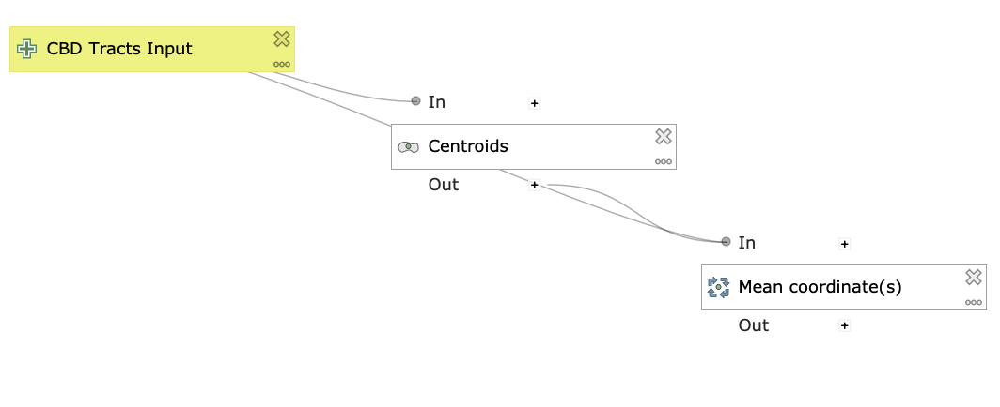
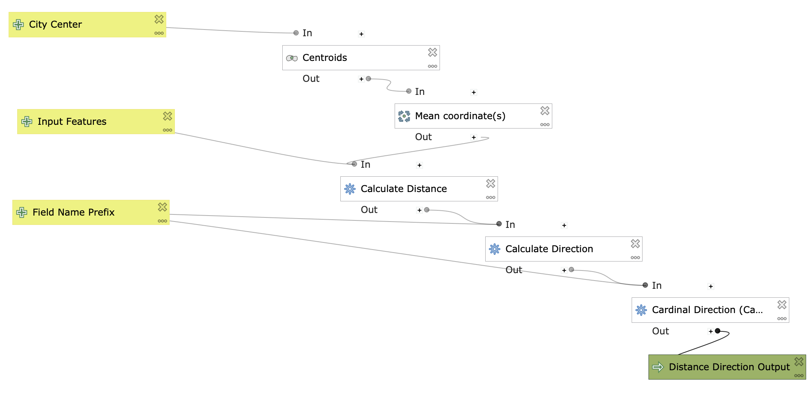
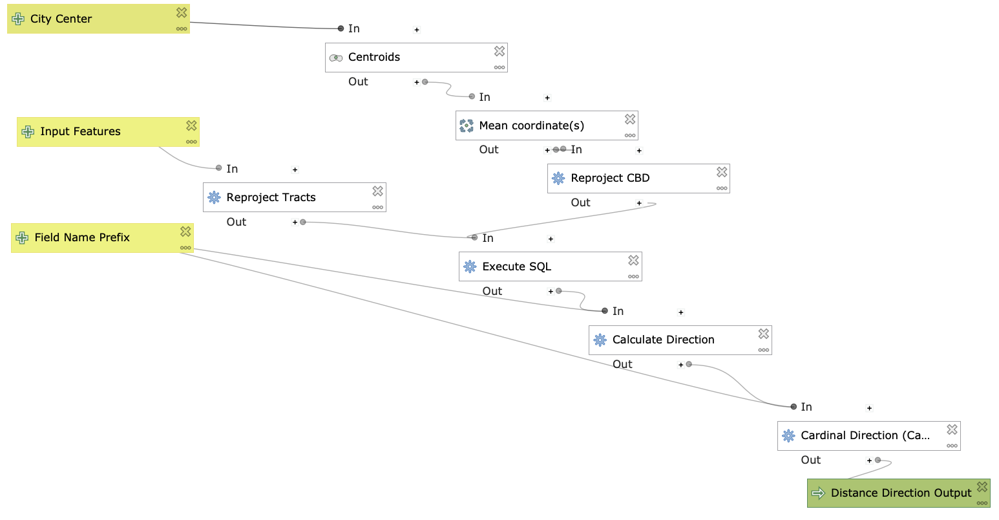
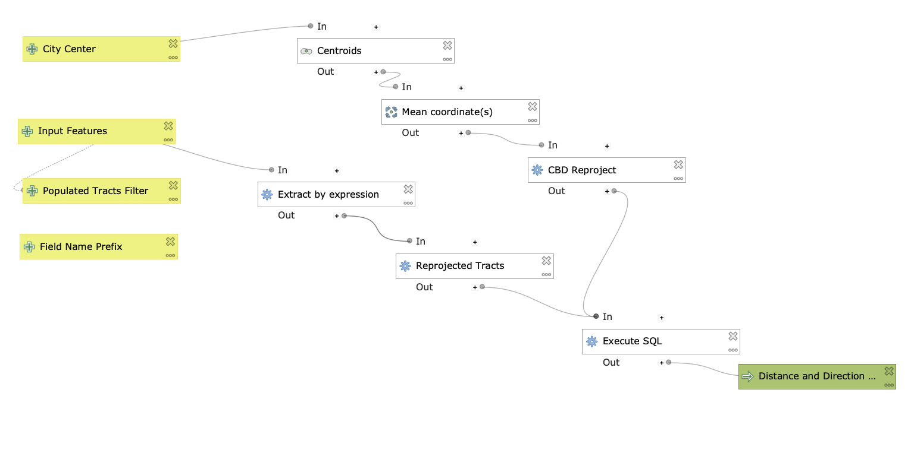
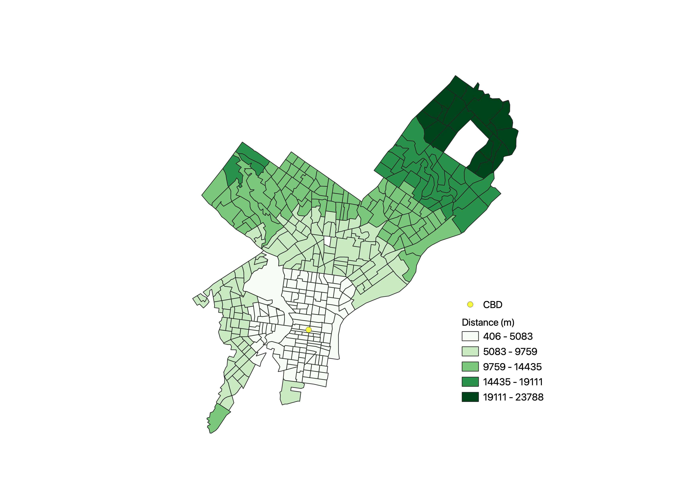
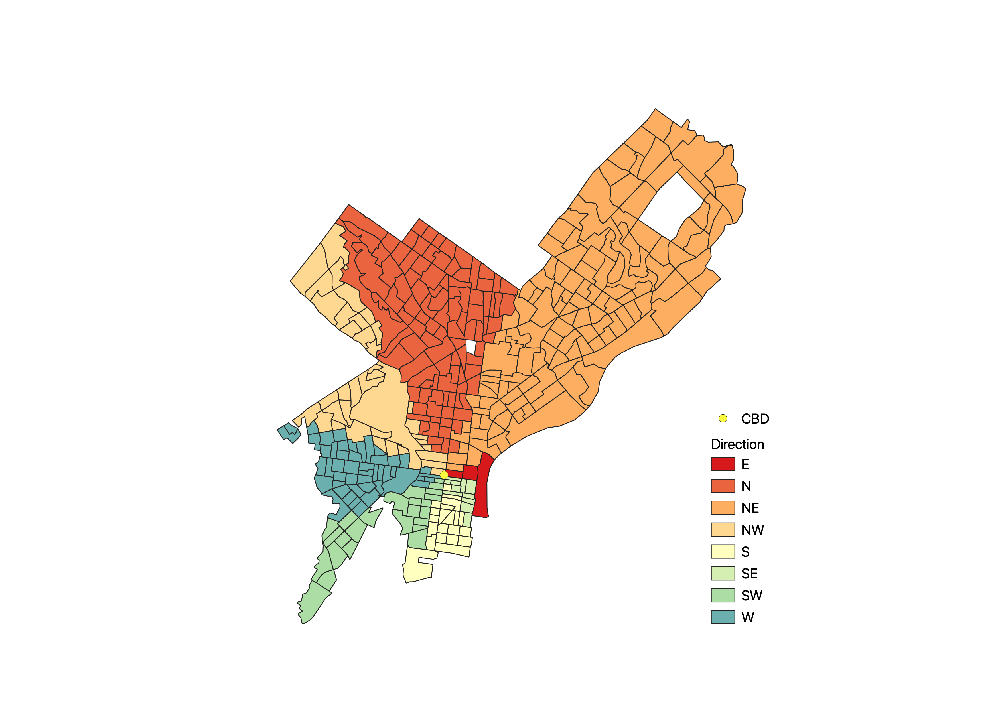
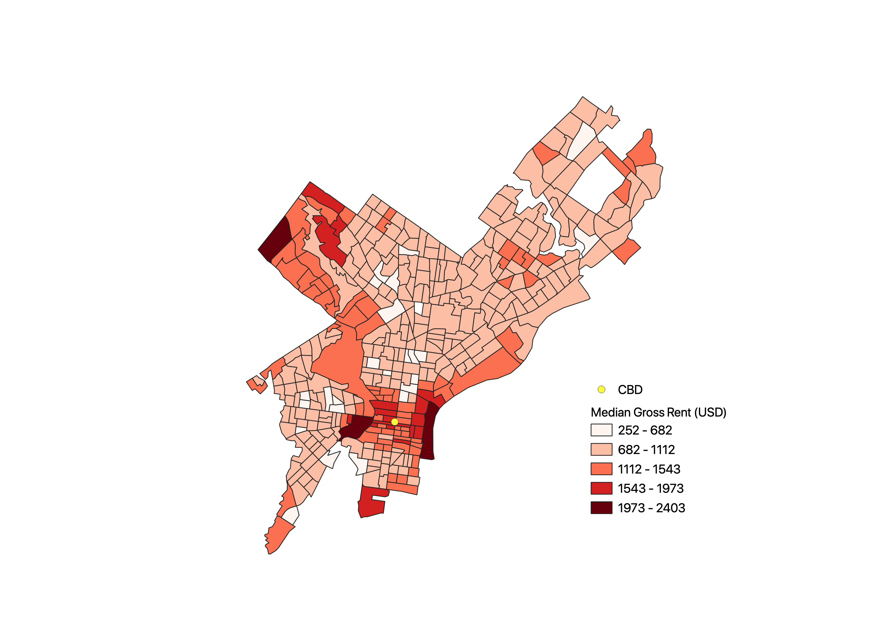

# Distance and Direction Modelling in QGIS

### Purpose

The goal of this lab was to build a model using open source tools to calculate and visualize the distance and direction of census tracts from the central business district of a city. Further analyses on the data were also done to understand the demographic structure of the city. This can be a useful tool to test geographic theories of [urban growth](https://www.opengeography.org/ch-9-urban-geography.html). In this exercise, I started out by building a test model on data from Chicago census tracts. Once the model was up and running, I tested its transferability on Philadelphia census tracts and updated it.

### Data

Data for this exercise was gathered from the U.S. Census website and compiled into a geopackage. The Philadelphia census tract shapefiles were gathered from the Census [Cartographic Boundary Files](https://www.census.gov/geographies/mapping-files/time-series/geo/carto-boundary-file.html). Demographic and Median Gross Rent were gathered from [Fact Finder](https://data.census.gov/cedsci/) and joined to to the shapefile boundaries. 

Download the data from this [geopackage](data/PhiladelphiaData.gpkg)

### Download Models 

The follwing two models were created to perform these analyses:

[Model to create CBD as centroid from tracts](models/CBDasCentroidforMacOS.model3)

[Model to calcualte distance and direction from CBD using Field Calculator algorithms](models/DistDirModelFieldCalculatorMacOS.model3)

[Model to calculate distance and direction from CBD using SQL algorithm](models/DistDirModelSQLMacOS.model3) (preferred model)

### Model to Create CBD from Census Tracts



This model is helpful if you would like to perform the distance and direction calculations with your own set of data. The other two models will find your city's CBD just by using input tracts (you don't need to use this model before running the others), but if you would like to get an output feature of your CBD before running the other models, this model will be helpful.

The model takes the census tracts as its input and finds the centroid of each tract's polygon. Then, it takes the mean coordinates of those centroids to find the city center. To get an accurate CBD centroid, the best course of action is to select I number of tracts in the downtown area of the city (I selected 22 tracts in downtown Philadelphia) and run the model using 'selected features only'. This is because a city's central business district is rarely located in the city's geometric center.

### First Distance and Direction Model



The first draft of the model incorporates the algorithms from the CBD model and then uses three field calculator algorthims to calculate:

The distance of each tract's centroid from the city center by converting the tracts into centroids and then transforming both input's coordinate systems into    World Geodetic System 1984 (WGS84, EPSG:4326). This conversion allows for an ellipsoidal calculation that preserves accurate distance. In this model, the     
   distance  is calculated in decimal degrees.

  <details><summary> Code </summary>
  
  ```SQL
  distance(
  transform(centroid($geometry),layer_property( @inputfeatures2 ,'CRS'),'EPSG:4326'), 

  transform(make_point(  @Mean_coordinate_s__OUTPUT_maxx , @Mean_coordinate_s__OUTPUT_maxy  ),
  layer_property( @citycenter ,'CRS'),'EPSG:4326'))
  ```
  </details>
  
The direction in degrees of each tract from the city's center by converting the tracts into centroids and transforming both inputs' coordinate systems into World Mercator (EPSG:54004). This conversion allows for distance to be accurately preserved. 

  <details><summary> Code </summary>
  
  ```SQL
  degrees(azimuth(
  transform( make_point(@Mean_coordinate_s__OUTPUT_maxx ,@Mean_coordinate_s__OUTPUT_maxy),
  layer_property( @citycenter, 'CRS'),'EPSG:54004'),

  transform(centroid($geometry),layer_property(@inputfeatures2, 'CRS'), 'EPSG:54004')))
  ```
  
  </details>
  
The direction into 8 cardinal and intercardinal directions by taking the output from the direction algorithm and using a CASE statement to categorize degree intervals by labelling them N, NE, E, SE, SE... etc.
  
<details>
<summary>  Code </summary>
    
```SQL
  CASE

  WHEN attribute(concat(@FieldNamePrefix, 'Dir')) <= 22.5 THEN 'N'
  WHEN attribute(concat(@FieldNamePrefix, 'Dir'))  >= 337.5 THEN 'N'

  WHEN attribute(concat(@FieldNamePrefix, 'Dir')) <= 67.5 and attribute(concat(@FieldNamePrefix,      
  'Dir')) >= 22.5 THEN 'NE'

  WHEN attribute(concat(@FieldNamePrefix, 'Dir')) <= 112.5 and attribute(concat(@FieldNamePrefix,   
  'Dir')) >= 67.5 THEN 'E'

  WHEN attribute(concat(@FieldNamePrefix, 'Dir')) <= 157.5 and attribute(concat(@FieldNamePrefix, '
  Dir')) >= 112.5 THEN 'SE'

  WHEN attribute(concat(@FieldNamePrefix, 'Dir')) <= 202.5 and attribute(concat(@FieldNamePrefix,
  'Dir')) >= 157.5 THEN 'S'

  WHEN attribute(concat(@FieldNamePrefix, 'Dir')) <= 247.5 and attribute(concat(@FieldNamePrefix,  
  'Dir')) >= 202.5 THEN 'SW'

  WHEN attribute(concat(@FieldNamePrefix, 'Dir')) <= 292.5 and attribute(concat(@FieldNamePrefix,
  'Dir')) >= 247.5 THEN 'W'

  WHEN attribute(concat(@FieldNamePrefix, 'Dir')) <= 337.5 and attribute(concat(@FieldNamePrefix,
  'Dir')) >= 292.5 THEN 'NW'

  END
  ```
  </details>

### Updating the Model with SQL Queries

To update the model, I replaced the field calculator algorithms with an execute sql algorithm. While both models will perform the functions, this centralizes the three calculations into one algorithm which arguably reduces the model's complexity (although SQL queries are perhaps more difficult to correctly perform as they are text-based; there is GUI to guide the user).

#### First SQL 



To familiarize myself with the execute sql algorithim, I began by performing an sql query to calculate the distance from the tracts. Additionally, because the QGIS version for Mac OS uses an older version of GDAL (2.4.1), I needed to reproject both inputs before transforming them in the SQL query. This enables the SQL to read them in their correct coordinate systems and outputs a distance measurement in meters instead of decimal degrees. If using this model on a Windows OS, the reproject algorithms may be redundant.

<details><summary> Code </summary>
  
```SQL
SELECT *, st_distance(st_centroid(st_transform(geometry, 4326)), (SELECT st_transform(geometry, 4326) from input1), TRUE) as  [% @FieldNamePrefix %]Dist
FROM input2
```
</details>

#### Final SQL



To update the SQL version of the model, I added the two direction algorithms to the SQL query. Additionally, I added an 'extract by expression' algorithm that removes unpopulated tracts from the calculation. While I added a vector field inout to the model that allows for a user defined input for the extract expression, it is currently not working. This means, for now, that the user will have to rename their total population field in the attribute table of the census tracts to "Total".

<details><summary> Code </summary>
  
```SQL
SELECT dis_dir. *, 

CASE

WHEN [% @FieldNamePrefix %]Dir <= 22.5 THEN 'N'
WHEN [% @FieldNamePrefix %]Dir  >= 337.5 THEN 'N'
WHEN [% @FieldNamePrefix %]Dir <= 67.5 and [% @FieldNamePrefix %]Dir >= 22.5 THEN 'NE'
WHEN [% @FieldNamePrefix %]Dir <= 112.5 and [% @FieldNamePrefix %]Dir >= 67.5 THEN 'E'
WHEN [% @FieldNamePrefix %]Dir <= 157.5 and [% @FieldNamePrefix %]Dir >= 112.5 THEN 'SE'
WHEN [% @FieldNamePrefix %]Dir <= 202.5 and [% @FieldNamePrefix %]Dir >= 157.5 THEN 'S'
WHEN [% @FieldNamePrefix %]Dir <= 247.5 and [% @FieldNamePrefix %]Dir >= 202.5 THEN 'SW'
WHEN [% @FieldNamePrefix %]Dir <= 292.5 and [% @FieldNamePrefix %]Dir>= 247.5 THEN 'W'
WHEN [% @FieldNamePrefix %]Dir <= 337.5 and [% @FieldNamePrefix %]Dir >= 292.5 THEN 'NW'

END as [% @FieldNamePrefix %]CardDir 

FROM(SELECT *,

st_distance(
st_centroid(st_transform(geometry, 4326)), (SELECT st_transform(geometry, 4326) from input1), TRUE) as  [% @FieldNamePrefix %]Dist,

degrees(
azimuth((SELECT st_transform(geometry, 3395) from input1), st_centroid(st_transform(geometry, 3395)))) as  [% @FieldNamePrefix %]Dir

FROM input2) as dis_dir
```
</details>

### Results

#### Maps

##### Distance from CBD



##### Direction from CBD



##### Median Gross Rent 



#### Plots

I used DataPlotly to make the following plots:

The [distance from CBD scatter plot](plots/dist_plot.html) does not show a remarkable linear relationship between distance from CBD and median rent. Most tracts had a median rent below $1000 regardless of distance, although there is a spike in median rent price between 2,500 and 15,000 meters from the CBD.

The [direction from CBD polar plot](plots/dir_plot.html) displays the most expensive median rent in tracts primarily to the North East of the CBD. There is also a small spike in median rent in tracts to the South East.

The [percent white and distance from CBD scatter plot](plots/dis_pctwhite.html) shows that there is a high concentration of tracts with a low proportion of white residents from 5,000 to 15,000 meters from the CBD. This shows that many of the tracts just outside the city center have a low concentration of white residents. Otherwise, the distsribution of tracts with high proportions of white residents appears fairly random.

The [percent black and distance from CBD scatter plot](plots/dis_pctBlack.html) shows a high concentration of tracts with a high proportion of black residents between 5,000 and 15,000 meters from the CBD. Thus, we might infer that there is a high concentration of black residents just outside the city center. Otherwise, there appears to be a low concentration of black residents just inside 5,000 meters and beyond 15,000 meters outside the city center.

### Discussion: Benefit of Modelling with Free and Open Source Softwares

Using QGIS to model distance and direction allows us to perform GIS analyses not only for free, but also in a reproducible and user-defined setting. By building a model with software accessible to any user and sharing the data, models, and code, users can attempt to replicate the methodology in a comprehensive and scrutinous manner to check for errors (Singleton et al. 2016). Furthermore, this provides users the opportunity to integrate localized knowledge to fill in missing data or to correct innacurate data (Sieber 2004). Overall this provides a flexible environment for users to modify and reapply this model. In this specific scenario, it might be more likely for local governments to supplement missing population and rent data, but individual users could employ local knowledge to modify the location of the city's center. Furthermore, employing this analysis with open source tools and practices allows for it to be re-run with different data.

Another important concept that this study employs is using GIS in a tool-building context (Wright et al. 2997). User defined model building allows geographers to build tools that can test geographic theories in an empirical fashion (Wright et al. 1997). This could be seen as an effort to use GIS to strengthen our understanding of existing geographic theories, rather than use GIS in a strictly quantitative fashion. By building user defined tools, we can begin to reject the notion of GIS as a singular entity that grows linearly, but instead as one that can perhaps be interrupted if it is employed in a non-institutional setting (Sieber 2004; Martin & Wing 2007).

Despite the critical improvements of performing GIS analyses in an open source and user-defined setting, there are still some ideological shortcomings of this current mode of using GIS. One glaring barrier to this approach is that building models in QGIS requires a certain degree of technological literacy, and although code-based tool building provides room to understand the underlying processes (Singleton et al. 2016), it also presents a barrier to users who may lack the time or resources to learn the software language. On a more ideological level, these analyses can further contribute to positivism as a primary method of geographic thinking (Martin & Wing 2007). Although this model-building allows for user input, it is still operating in a software that has been developed to measure human phenomena in numeric terms. Ultimately, this model is accessible and reproducible but it does not allow us to understand the area of study qualitatively or with nuance.

#### References

Singleton, A.S., Spielman, S., & C Brundson, (2016). Establishing a framework for Open Geographic Information science. International Journal of Geographical Information Science, 30:8, 1507 - 1521,  https://doi.org/10.1080/13658816.2015.1137579

Martin, K. S., & Wing, J. (2007). The discourse and discipline of GIS. Cartographica: The International Journal for Geographic Information and Geovisualization, 42(3), 235-248. https://doi.org/10.3138/carto.42.3.235

Sieber, R. (2004). Rewiring for a GIS/2. Cartographica: The international journal for geographic information and geovisualization, 39(1), 25-39. https://doi.org/10.3138/T6U8-171M-452W-516R

Wright, D. J., Goodchild, M. F., & Proctor, J. D. (1997). Demystifying the persistent ambiguity of GIS as ‘tool’versus ‘science’. Annals of the Association of American Geographers, 87(2), 346-362. https://doi.org/10.1111/0004-5608.872057
